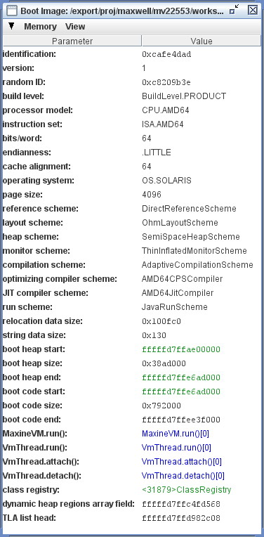

VM Boot Image
=============

Starting an instance of the Maxine VM requires the use of a previously constructed boot image, a near-executable binary VM image that includes an initially populated heap, together with compiled code for a dedicated target platform.

Boot image contents
-------------------

The boot image is a binary file that contains a near-executable memory image of the running VM in the format of the target platform for which the image was generated.
The target platform is not required to be the same as the platform on which the boot image generation is run (i.e. hosted).

The utility class ``BootImage`` is responsible for writing the boot image file in the format of the target platform.
This data must be read by native C code during VM startup, so there is necessary agreement between the layout as expressed in the Java class BootImage and in the native startup code.

Below you can see the boot image layout summarized as a pseudo-C struct.
This diagram is excerpted from the Javadoc comments for class ``BootImage``.

.. code-block:: c

    struct BootImage {
         struct Header header;            // see declaration of image_Header in Native/substrate/image.h
         struct StringInfo string_info;   // see declaration of image_StringInfo in Native/substrate/image.h
         byte[header.relocationDataSize] relocation_data;
         byte[] pad;                      // padding such that next field will be aligned on an OS page-size address
         byte[header.heapSize];           // header.heapSize is a multiple of page-size
         byte[header.codeSize];           // header.codeSize is a multiple of page-size
         struct Trailer trailer;          // see declaration of image_Trailer in Native/substrate/image.h
    }

The boot image contains the following groups of information:

-  **header:** a sequence of integer parameters that identify the binary, describe the target platform, and include specific data about the remaining contents of the image.
-  **string info:** a sequence of strings in native format that describe the build, name the classes that provide detailed platform description, and name the packages that are bound to the schemes in the build.
-  **relocation data:** a bit field that identifies address locations in the image that need to be relocated.
-  **boot heap:** binary image of a heap in target platform format, pre-populated with the objects that represent class and other runtime data needed by the VM until it can begin loading classes on its own.
-  **boot code:** binary image of method compilations in target platform format, pre-populated with the compilations needed by the VM until it can begin compiling methods on its own.
-  **trailer:** a subset of the integer parameters that also appear in the header, repeated for verification.

Inspecting the boot image
-------------------------

The Boot Image Inspector view in the Maxine Inspector displays summary
information about the specific boot image being viewed: identifying
parameters, configuration classes for various schemes, memory region
information about the boot heap and boot code, and other specific
references into the heap and compiled code.

BOOT image generation
---------------------

Maxine's boot image generator creates a boot image according to a specification (see ``com.sun.max.vm.VMConfiguration``) that both specifies which implementations of particular Schemes should be included and describes the platform on which the image is intended to run.

Class loading and initialization
~~~~~~~~~~~~~~~~~~~~~~~~~~~~~~~~

Any class that might be written into the boot image must first be loaded by the boot image generator.
Loading can happen in two ways.
First any class that is used by the classes that comprise the boot image generator is loaded by the normal host class loading mechanisms, that is using the system class loader.
Note that the boot image generator uses many of the same classes as the VM.
Second, the generator explicitly loads classes that might be written into the boot image by scanning the class path and searching for sub-packages of com.sun.max.config that contains a class named Package that is a subclass of com.sun.max.config.BootImagePackage.
The Package classes act as roots for the set of packages to be included in the boot image.
BootImagePackage provides a mechanism for including packages that are outside the com.sun.max namespace.
See below for details.
This second set of classes is actually loaded by a special class loader, com.sun.max.vm.hosted.HostedVMClassLoader, that performs additional actions, such as creating the Maxine representation of classes used at runtime.
HostedVMClassLoader delegates to the system or boot classloader, as appropriate, so a class is only loaded and initialized once, even if it was initially loaded implicitly by the boot image generator.

As noted, Loaded classes are initialized, which means that static class variables in the boot image have values assigned during image generation.
Mostly this is perfectly fine, for example, an instance of a collection class.
The problem arises with classes that capture values that are host-specific and inappropriate for the target VM environment.
Typically this is any value related to the external environment, which includes the operating system and host virtual machine.
An example of the latter would be any object that contains a VM-specific native value, for example a soft reference.
The boot image generator takes care of all the known cases in the JDK classes, and this is handled in the class ``com.sun.max.vm.hosted.JDKInterceptor``.
Extension classes can register a class to have the class initialization re-run at run-time.
Except for such classes, no code is generated in the boot image for static initialization.

Class and method selection
~~~~~~~~~~~~~~~~~~~~~~~~~~

Intuitively, the boot image is intended to contain all the classes and
methods that are needed to bootstrap the VM to the point where it can
dynamically load further classes from the file system and compile
methods for execution.
In order to minimize the size of the boot image, only those classes
should be included.
In practice this set is not easy to define precisely and depends,
amongst other things, on the details of the JDK implementation.
In particular, it can vary from release to release of the JDK.

The Maxine boot image generator determines the content of the boot image by starting from so-called entry points plus a subset of the standard platform classes that are known to be necessary for the bootstrap.
An entry point is a method that:

-  can be called from the external environment (e.g. those annotated
   with ``@VM_ENTRY_POINT``),
-  is called by pre-compiled/generated code such as stubs,
-  is a reflection invocation stub for methods called during class
   loading or compilation,
-  is manually selected to satisfy bootstrap requirements (and avoid
   infinite recursion at runtime), or
-  is manually selected to improve startup time at runtime.

These entry points form the basis of the analysis used to discover the methods needed to bootstrap the VM.
An example is the run method in ``com.sun.max.vm.MaxineVM``, which is the entry point from the native C code that starts the VM bootstrap.
Another mechanism for specifying an entry point is the ``com.sun.max.vm.runtime.CriticalMethod`` class.

Extending the boot image
------------------------

Maxine supports both static and dynamic extension of the VM boot
image.
Static extension adds extra classes to the boot image generation
process.
Dynamic extension is supported using a similar mechanism to that for
Java agents,

Static Extension
----------------

Static extension provides the opportunity to customize the set of classes to be included in an image.
For example, if you need to extend the VM in a way that requires some of the extension classes to execute before the VM is ready to load new classes, then those additional classes must be included in the boot image.

It is possible to augment the boot image with much larger set of classes, in the limit, every class needed by an application.
Such an image would be self contained and require no dynamic class loading at run-time.
In certain cases this might be desirable; however, there are issues regarding class initialization that may need to be addressed.

Class re-initialization
~~~~~~~~~~~~~~~~~~~~~~~

As noted above, static class variables in the boot image will have values assigned during boot image generation unless handled specially by the ``com.sun.max.vm.hosted.JDKInterceptor`` class.
It is your responsibility to check any extension classes you are adding.

Specifying additional classes or packages
~~~~~~~~~~~~~~~~~~~~~~~~~~~~~~~~~~~~~~~~~

The simplest way to do this for a one-time image build is to suffix the class names or packages to the max image command:

.. code-block:: shell

    % mx help image
    mx image [options] classes|packages...

    build a boot image

        Run the BootImageGenerator to build a Maxine boot image. The classes
        and packages specified on the command line will be included in the
        boot image in addition to those found by the Package.java mechanism.
        Package names are differentiated from class names by being prefixed
        with '^'.
    ...

For example, to add all the classes in the package ``acme.demo`` as well as the single class ``foo.Bar``:

.. code-block:: shell

    % mx image ^acme.demo foo.Bar

Note that packages are not processed recursively, that is, nested packages are not included unless explicitly specified.
Note also that the above command assumes that the classes are located within one of the Maxine directories.
If this is not the case, their location must be specified with the ``--cp-sfx`` option.
In addition, methods in the extension classes will only be compiled if they meet the conditions outlined above in `Class and method selection <#class-and-method-selection>`__.
Finally, protection issues may require your classes to be defined in a Maxine package if your extension classes need package-private access to any Maxine classes.
For more permanent additions to the boot image, or to meet access requirements, the easiest approach is to put your classes in in a sub-package of ``com.sun.max`` in one of the existing Maxine projects, and leverage the automatic loading mechanisms described in the earlier section `Class loading and initialization <#class-loading-and-initialization>`__.
While this approach might be acceptable for short-term prototyping, it is inappropriate in the long term unless the code is blessed as a standard VM component.

If you place your classes in a sub-package of com.sun.max, whether in an existing project or not, there is one caveat:

-  If your classes are not in an existing Maxine directory, be sure to
   use the ``--cp-sfx`` option to add the directories to end of the
   classpath.
   If you add them at the front (with ``--cp-pfx``), you may well break
   the mechanism by which the hosted native library is found.

The recommended approach for extending Maxine is to place the extension packages in a separate project.
To satisfy the discovery mechanism of the boot image generator, all extension packages must be rooted in a sub-package of ``com.sun.max.config``, for example, ``com.sun.max.config.acme``.
However, it is possible to redirect to packages outside the ``com.sun.max`` namespace.
An extension package to be included in Maxine should contain a ``Package`` class that extends ``BootImagePackage``.
``BootImagePackage`` provides four constructors:

#. ``BootImagePackage()``: the default constructor is used to include
   just those classes in the package containing the ``Package`` class.
#. ``BootImagePackage(boolean)``: this constructor, with a value of true
   is used to include the classes in the package containing the
   ``Package`` class and all sub-packages, recursively.
   In particular, there is no need for ``Package`` classes in the
   sub-packages.
#. ``BootImagePackage(String, boolean)``: this redirection constructor
   includes the classes in the package passed as
   argument.
   Sub-packages are only included if the boolean argument is true.
#. ``BootImagePackage(String...)``: this constructor serves two
   purposes.
   First to include (redirected) packages outside the com.sun.max
   namespace and, second, to restrict the set of classes that are
   loaded from a given package.
   The interpretation of the argument is based on the following
   patterns:

   -  ``a.b.c.*``: include all classes from the package ``a.b.c``.
   -  ``a.b.c.**``: include all class from the package ``a.b.c`` and its
      sub-packages, recursively.
   -  ``a.b.c.D``: include the class ``a.b.c.D``.

Note that, by design, there is no way to exclude a class from a package, other than by explicitly enumerating all the classes except the one to exclude.

It is legal for a package to be referenced multiple times by different Package constructors.
For example, two separate constructors might specify different classes to be included.
The final specification is the result of merging the specifications.

Note that the packages generated using ``BootImagePackage`` are only candidates for inclusion in the image.
A package is only actually included if the method ``BootImagePackage.isPartOfMaxineVM()`` for the ``Package`` instance returns true.
This allows additional controls, such as system properties, to fine tune the inclusion.
For recursive and redirected packages, ``Package`` instances are created automatically by cloning the ``Package`` that initiated the inclusion, then modifying the package name.
Therefore any overridden methods, such as ``isPartOfMaxineVM()``, in the including ``Package`` will be in effect in for all the included packages.
However, any actual ``Package`` classes that do exists in included sub-packages are instantiated and replace the clone.

Configuring the extensions classes
^^^^^^^^^^^^^^^^^^^^^^^^^^^^^^^^^^

As noted above, adding an extension class does not necessarily cause its methods to be compiled in the boot image.
Static fields may also need to be reset if they contain host-specific values and it may also be necessary to re-run the static initializer to create the illusion that class was actually loaded at run-time by the VM.
The class ``com.sun.max.vm.hosted.Extensions`` provided several methods to achieve these goals:

-  ``resetField(String className, String fieldName)``: reset a static
   field back to its default value.
   Note that presently there is no check on the value of either of
   these arguments, and bad values will be silently ignored.
-  ``registerClassForReInit(String className)``: run the static
   initializer on VM startup.
-  ``registerVMEntryPoint(String className, String methodName)``:
   register a method as a root for inclusion in the boot image.

Dynamic Extension
-----------------

A dynamic (VM) extension is packaged in a jar file and loaded by the VM class loader at runtime, just before the main class is loaded, in a very similar way to that for Java agents.
The essential difference is that Java agents are considered application extensions and loaded by the system class loader, whereas a VM extension is loaded by the VM classloader.
This allows the VM extension classes to reference the VM classes in the boot image and use the extended features of Maxine, e.g., Maxine annotations and systems programming support.

A VM extension jar file must contain a manifest that defines a VMExtension-Class attribute that specifies the class that is the entry point to the extension, e.g.:

::

    Manifest-Version: 1.0
    VMExtension-Class: com.oracle.max.vm.ext.acme.AcmeExtension

This class must define a method with the following signature:

.. code-block:: java

    public static void onLoad(String args);

The VM is fully functional at the time that this method is called but, as for Java agents, the method must return for the startup sequence to proceed.
If the extension cannot be resolved (for example, because the extension class cannot be loaded, or because the extension class does not have a conformant onLoad method), the VM will abort.
If an ``onLoad`` method throws an uncaught exception, the VM will abort.

To load the extension at runtime use the ``--vmextension:jarpath[=args]`` option, ``vis``:

.. code-block:: shell

    mx vm --vmextension:acme_vmextension.jar=args ...

Multiple extensions may specified and they are processed in the order
they appear on the command line.
The jar file is appended to the class path used by the VM
classloader.
If reference needs to be made to additional classes outside the jar
file, these may be specified using the optional manifest attribute
VM-Class-Path which has a similar specification to Boot-Class-Path for
Java agents.
