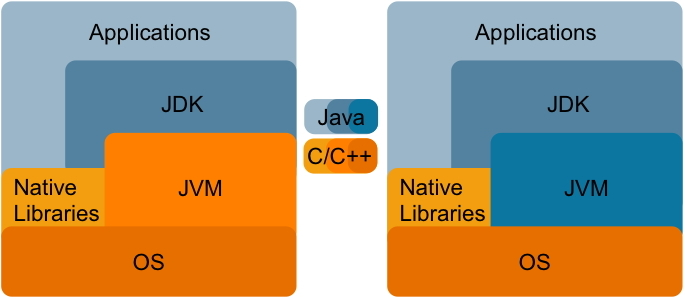

Glossary of Maxine terminology and concepts
===========================================

Welcome to the Maxine Glossary, a very informal and evolving set of
brief notes to help orient newcomers to some of the terminology and
concepts we use when talking about the Maxine VM.
Please feel free to
write `to us <https://groups.google.com/forum/#!forum/maxinevm>`__ with
comments and suggestions.
It is definitely a work in progress.

You might also want to browse the :doc:`Maxine FAQ <./FAQ>`.

We thank our collaborators who have been contributing documentation as
well; we link to it from this page and others whenever possible.

Alias
-----

A specially marked field or method in a VM class that refers to a field
or method in another class that would otherwise be inaccessible due to
Java language access control rules.
Used mainly for VM access to private members of JDK classes.

:doc:`Read more <./JDK-Interoperation>`.

Annotations
-----------

The Maxine VM code makes heavy use of Java Annotations as a form of
language extension.
These extensions, which are recognized and treated specially by the
Maxine compilers, permit the kind of low-level, unsafe programming that
is otherwise not possible with Java.
By using the Java annotation mechanism, which is a first class part of
the language, the Maxine sources are completely compatible with Java
IDEs.
See package ``com.sun.max.annotate``.

Here are a few of the important Maxine annotations:

-  ``@ALIAS``: denotes a field or method as an alias, which can be used
   to access a field or method in another class that would otherwise be
   inaccessible due to Java language access control rules.
-  ``@BUILTIN``: denotes a method whose calls are translated directly by
   the compiler into machine code.
-  ``@C_FUNCTION``: denotes a native function for which a lightweight
   JNI
   stub should be generated.
-  ``@CONSTANT_WHEN_NOT_ZERO``: denotes a field whose value is final
   once
   it is non-zero.
-  ``@CONSTANT``: denotes a field whose value is final before it's first
   read (i.e. a stationary field).
-  ``@FOLD``: calls to these methods are evaluated (as opposed to
   translated) at compile time.
-  ``@INLINE``: forced inlining.
-  ``@INSPECTED``: used by an offline tool to generate field and method
   accessors for the Maxine Inspector.
-  ``@METHOD_SUBSTITUTIONS``: denotes a class containing.
   ``MethodSubstitutions``
-  ``@NEVER_INLINE``: denotes a method that this compiler must never
   inline.
-  ``@SUBSTITUTE``: denotes a ``MethodSubstitution``.
-  ``@UNSAFE``: marks a method that requires special compilation; some
   other annotations imply ``@UNSAFE``.

Boot heap
---------

An object heap embedded in the VM boot image.
It is a normal heap, with the exception that objects in it never move
(although they may become permanent garbage).
As the name implies, the objects in this heap are those allocated during
boot image generation.
The boot image is really just this heap plus a little meta-data in
front.

:doc:`Read more <./Boot-Image>`.

Bootstrap
---------

The process of loading and executing a boot image of
Maxine, up to the point where the VM is ready, either to execute a
specified application class or other action specified by the run scheme.

Currently a boot image of Maxine is not a native executable but just a
binary blob containing machine code and data for a dedicated target
platform.
Thus a boot image is not executable by itself.
To start it a very small native C application is required.

See :doc:`Boot Image <./Boot-Image>`.

Graal Compiler
--------------

See `Graal <https://github.com/graalvm/graal-core>`__.

Immortal memory
---------------

See the ``ImmortalHeap`` class as well as the various ``ImmortalHeap_*``
classes that test this functionality.

See class ``com.sun.max.vm.heap.ImmortalHeap``

Injected fields
---------------

During startup the VM synthesizes and injects additional fields into
core JDK classes.
Injected fields typically link instances of JDK objects to their
internal VM representation.
:doc:`Read more <./JDK-Interoperation>`.

Maxine packages
---------------

A mechanism for treating groups of classes in Java package as a de facto
"module" for purposes of system configuration and evolution.
This requires implementing more functionality than is provided by the
Java language via ``java.lang.Package``.

This main application of this mechanism is to define the classes to be
including during Maxine
:doc:`boot image generation <./Boot-Image>`, and in
particular to specify which implementations to bind to VM schemes.

Strictly speaking, a Maxine package is a collection of classes in a Java
package that includes a class named ``Package``.
The class Package must extend class
``com.sun.max.config.BootImagePackage`` in order to be considered for
inclusion in the VM.
The ``Package`` class, other than acting as a marker, may contain
additional specifications directed at the Maxine package system.
In many cases, however, trivial ``Package`` class can be synthesized
dynamically and need not be explicitly defined.

Metacircular VM
---------------

In a conventional VM implementation (left in the figure below) there is
a language barrier between the language being implemented (Java in the
figure) and the implementation language (C++).
No such barrier exists in Maxine, where the VM is itself implemented in
the language being implemented.

See also: Ungar, D., Spitz, A., and Ausch, A. 2005. Constructing a
metacircular Virtual machine in an exploratory programming
environment. In *Companion To the 20th Annual ACM SIGPLAN Conference on Object-Oriented Programming, Systems, Languages, and Applications* (San
Diego, CA, USA, October 16 - 20, 2005). OOPSLA '05. ACM, New York, NY,
11-20. `DOI <http://doi.acm.org/10.1145/1094855.1094865>`__

package-info.java
-----------------

A documentation class, following Javadoc convention, for the classes and
interfaces in a Java package; this is especially encouraged for packages
that constitute Maxine package and serve as modules for VM
configuration.

Package.java
------------

A class used for configuration purposes by the Maxine Package mechanism.

ReferenceMapInterpreter
-----------------------

The ReferenceMapInterpreter performs an iterative data flow analysis via
abstract interpretation.
The following option maybe useful to watch it in action:

::

    -XX:TraceRefMapInterpretationOf=<value>

The help message for this option is: "Trace ref map interpretation of
methods whose name or declaring class contains ."

A short summary of its operation follows, contributed by Arian Treffer.

-  To collect GC roots, the GC needs to know which variable and stack
   slots in a stack frame contain references.
-  For the beginning of each code block, a bitmap (called "frame") that
   indicates used reference slots is cached.
-  A block is a sequence of byte codes in a method that can be executed
   without jumping (out or into).
   A block either ends with a (implicit) fall through, a jump, or a
   return.
-  To create frames, the blocks are pseudo interpreted: their pop and
   push behavior is simulated.
   The slot configuration at the end of a block is the frame for all
   blocks that can be reached from here (2 in case of a conditional
   jump, 0 in case of a return, otherwise 1).
-  When a block can be reached from multiple other blocks, its frame is
   the intersection of the final slot configuration of its
   predecessors.
   If one predecessor stored a reference in a slot, and another did
   not, the current block may not read this slot, for it doesn't know
   its contents.
-  The stack size at the beginning of a block is always the same.
   There is no Java code that first pushes N items (i.e. in a loop),
   and later pops them, even though this could be expressed with byte
   codes.
-  To get the slot configuration at the current execution point, the
   current block is interpreted again up until the current byte code,
   where the slot configuration is converted into a bitmap that
   indicates references on the current stack frame.

Stop positions
--------------

A list of call and safepoint instructions within a target method.
These locations correspond to all possible addresses the instruction
pointer of a frame may have when its thread is stopped at a
safepoint.
The location of all references on the stack are precisely known when at
a stop position.
See :doc:`Threads <./Threads>`.

.. _t1x-compiler-label:

T1X compiler
------------

T1X is a template-based baseline compiler and is Maxine's first line of
execution (Maxine has no interpreter).
As such, it's primary goal is to produce code as fast as possible. Code
quality is of secondary concern.
It also closely matches the JVM specification's execution models.
That is, the JVM operand stack and local variable variable array is
modeled directly.
This makes it suitable for implementing bytecode level debugging as well
being the execution mode the de-optimization process uses as its end
target.

The templates for each bytecode instruction are written in Java (see
``T1XTemplateSource``) and compiled to machine code by C1X (which is to be
replaced by Graal).
These machine code snippets are stored in a table and used to translate
bytecodes at T1X compile time.
The translation is done in a single pass (see ``T1XCompilation``) and GC
maps are lazily generated via an abstract interpreter at GC time.
The latter strategy pays off as a GC map is only generated for a T1X
compiled method if it is currently active during GC root
scanning.
Another strategy to improve compile time is to minimize allocation
during compilation.
This is achieved by (re)using thread local data structures for each
compilation.

Having the templates written in Java makes modifying or extending the
compiler fairly easy.
More importantly, it also means the compiler is very portable and it
mostly relies on the optimizing compiler.
It performs very little direct machine code generation.

The source code for T1X is entirely contained in the top level T1X
directory of the Maxine source code base.

Target method
-------------

A target method in the Maxine VM is the entity that contains some
machine code produced by one of the compilers in Maxine.
It also contains all the other data required by the VM for some machine
code.
In particular, target methods (implemented by heap objects in the class
hierarchy rooted at ``TargetMethod.java``) encapsulate the following
information, including some that resides not in the heap but in the
region of code cache memory allocated for the compilation.

-  Machine code, represented as a reference to a ``byte[]`` that is
   stored in the method's code cache allocation.
-  Reference literals (optional, but common): represented as a
   reference to an ``Object[]`` that is stored in the method's code
   cache
   allocation.
-  Scalar literals (optional, much less common): represented as a
   reference to a ``byte[]`` that is stored in the method's code cache
   allocation.
-  Exception handler information. This is a data structure that can be
   used to answer the question "for an exception of type t thrown at
   position n in the target method, what is the position, if any, of an
   exception handler in the target method that will handle the thrown
   exception?".
-  The stop positions.
   A stop is a machine code position for which extra information is
   known about the execution state at that position.
   There types of stop positions in Maxine and the information recorded
   for them are shown below:

   -  **Call**.
      This is the position of a call (direct or indirect)
      instruction. For a call, the following is recorded:

      -  Frame reference map.
         This is a bit map with one bit per slot in the frame of the
         method.
         A set bit in this bit map indicates that the corresponding
         frame slot holds an object reference at the call.
      -  Java frame descriptor.
         This is a map from locations in the bytecode-level frame
         state to locations in the machine state.
         The bytecode level frame state is composed of the local
         variables and operand stack slots addressed by the JVM
         bytecodes from which the machine code was produced.
         The machine state is composed of frame slots, registers and
         immediate instruction operands.
         The mapping enables the JVM state to be completely
         reconstructed at the stop position.
         This is useful for implementing source level debugging and
         deoptimization.

   -  **Safepoint**.
      This is the position of a safepoint instruction.
      For a safepoint, all the information described for a call is
      recorded as well as:

      -  Register reference map.
         This is a bit map with one bit per register that can be used
         to store an object reference.
         This includes the complete set of general purpose registers
         for the platform but exclude all the floating point and
         state registers.
         Like a frame reference map, a set bit in the register
         reference map indicates that the corresponding register is
         holding an object reference at the safepoint.

[STRIKEOUT:Currently register reference maps are not recorded for calls
as all
registers are caller saved by the compilers in Maxine.
This will mostly likely change in the near future as C1X will implement
callee-save registers when compiling certain methods.] (Out of date?)

See abstract ``com.sun.max.vm.compiler.target.TargetMethod``

Trampoline
----------

The mechanism used to defer binding a call site to a target method.
When compiling a call, an address is needed for the machine level call
instruction.
One option is to eagerly resolve the callee during compilation of the
call but this will end up compiling the world!
Instead, a piece of code is called that knows how to find and compile
(if necessary) the intended target method and redirect the call
there.
For static calls, the call site itself is patched so that subsequent
calls go straight to the resolved method.
For virtual calls, the trampoline patches the entry in the relevant
dispatch table.
