The Maxine Inspector
====================

The Maxine Inspector is the essential all-in-one companion tool for Open Source Maxine VM development.
It plays many roles:

-  object, class, and method browser;
-  code views include disassembled machine code, disassembled bytecode, and source;
-  low-level debugger (imagine gdb or dbx) with visual displays of threads, registers, stacks, stack frames, thread local values, breakpoints, memory watchpoints, etc.;
-  intermediate representation debugger;
-  source-level Java debugger (eventually); and
-  serviceability agent (eventually).

`This short (5 minute) 2009 video <https://youtu.be/ZOq2y5fTaHc>`__ describes the goals of the inspector and highlights some of the ways in which it makes Maxine VM development highly productive.

Please be aware that the Inspector is very much a work in progress, as is the Maxine VM itself.
The two have co-evolved and will continue to do so as the design of the VM matures and the concerns of the developers expand.
Functionality is constantly being improved and extended, so there are already places where the current system differs from what you will find here.

More discussion and more detailed documentation follows below.

Goals
-----

In addition to enhancing the productivity of our own development team, the Maxine Inspector is part of our strategic goal of making VM experimentation more accessible to a wider audience.
By leveraging the meta-circularity of the VM itself (and sharing a great deal of the VM's source code), the Inspector makes it possible to visualize concisely many aspects of VM state that are elusive and widely distributed in other systems.
These same advantages also make it possible to debug the VM with a single tool, highly specialized for this purpose.

Background and Rationale
------------------------

Debugging virtual machines (VMs) presents unique challenges, expecially for a meta-circular VM, such as Maxine, that is self-implemented in the same language it implements.
Making sense of Maxine's runtime state requires interaction simultaneously at the source, bytecode, and machine code abstraction levels, and it must leverage knowledge of the VM's design.
Specific issues include:

-  Maxine VM code must be largely optimized statically, not only for
   ordinary performance reasons, but also in order to be able to
   bootstrap the VM at all.
-  Dynamic optimization at runtime can be applied to the VM's own
   implementation, not just application code.
-  Mapping optimized code locations back to bytecode and source
   locations is not generally possible without onerous limitations.
-  Dynamically de-optimizing code for debugging can be effective for
   application code, but only when the VM can be assumed correct.
-  Debugging the VM itself, however, requires scrutinizing its
   lowest-level, most optimized code representations and runtime
   machine state.
-  Special considerations arise when debugging garbage collection, for
   example the Inspector's dependence on the VM's meta-information
   about classes, methods, etc., which are represented as ordinary
   :doc:`Java objects <./Objects>` in the heap; garbage collection,
   however,
   routinely breaks the heap invariants that make those objects
   accessible.
-  Good debugging support is paramount for a VM intended for
   experimentation and fast prototyping.
-  The Maxine Inspector addreses these concerns, supporting
   comprehensive inspection and interaction at all program
   representation levels.
-  Finally, these services must be available to developers in a wide
   variety of contexts: examining a pre-execution
   :doc:`boot image <./Boot-Image>`, examining and controlling a live VM
   process (local or remote), and post-mortem examination of a VM core
   dump.

Furthermore, the Inspector's design exploits the fact that it is implemented in the same language that the VM implements and is implemented in; this gives rise to many code reuse opportunities.
For example, the same mechanisms used by the VM's :doc:`boot image generator <./Boot-Image>`, which allow the creation of objects in the binary runtime format for a potentially different platform, can be used by the Inspector to examine binary runtime state for a potentially different platform than the Inspector's host.

Downloading and Building the Inspector
--------------------------------------

The Inspector source code is part of the Maxine VM repository.
It will :doc:`download and build <./build>` automatically with the rest of the Maxine code.
See also Inspector-specific issues on :doc:`various platforms <./build>`.

A Tour Through The Maxine Inspector
-----------------------------------

The best way to learn about the Inspector (and about many aspects of the Maxine VM) is to start up the Inspector on a simple VM session.
For a beginner's introduction, however, the following pages introduce specific aspects of the Inspector's operation, in some cases with short video segments.
The topics are threaded in a sequence so that you can navigate through them in order if you are new to the Inspector.

Boot Image Configuration
~~~~~~~~~~~~~~~~~~~~~~~~

A good introduction to some of the Maxine VM's architectural features is provided by the Inspector command via the Boot Image info entry on any `View <#view>`__ menu.
This produces an Inspector window displaying configuration parameters of the boot image being inspected.
The boot image and its configuration can be inspected with or without a running VM process.

`This short 2008 video <https://youtu.be/Ieoqp5TUUJ4>`__ demonstrates this view, although some evolution has taken place since then.

A more detailed description of the display appears below.

The Boot Image Inspector
^^^^^^^^^^^^^^^^^^^^^^^^

The boot image contains several groups of configuration parameters, each of which relates to some aspect of the Maxine implementation.
The Boot Image Inspector displays them in a simple tabular format, with entries in several general categories:

-  *Identification* of the particular boot image build.
-  Basic *build options*, e.g. ``DEBUG`` or ``PRODUCT``.
-  *Target machine properties*: the model, instruction set, word size,
   endianness, etc. for which code is compiled, both in the boot image
   and at run time.
-  *Operating System properties*.
-  *Maxine schemes*: pluggable modules that implement specific functions
   in the VM.
   For example, the *grip scheme* implements low level memory
   addressing, at which level garbage collection takes place; the *run
   scheme* directs what happens at VM startup, which could be running a
   standard Java program, as in the example, but could something else
   specified at build time.
-  Parameters describing the *boot heap*: a pre-populated heap segment
   containing objects created at build time, in the same format as the
   dynamic heap segments created at run time.
-  Parameters describing the *boot code* region of memory, which
   contains compiled code in the same format as the regions of compiled
   code that are created by dynamic compilation and recompilation at
   run time.
-  *Code entry pointers*: specific addresses in the boot code region
   (displayed symbolically by the inspector in the example) for
   distinguished methods that will be called at VM startup.
-  *Distinguished object pointers*: specific addresses in the boot heap
   region for objects of importance at VM startup, for example the root
   ``ClassRegistry`` object (displayed symbolically by the inspector in
   the example).

.. image:: images/Inspector-BootImage.jpg

As with many data displays in the Inspector, the items in the Value
column have additional useful behavior.
For example, most provide additional information about the displayed
value in a mouse-over "Tooltip" display that appears when the mouse
hovers over the display.
In simple cases, such as integers, the Tooltip might display the value
in another base.
For example the page size item displays in decimal by default, but the
hexadecimal value appears in the Tooltip.
Conversely, the boot heap size displays in hexadecimal by default, and
the decimal value appears in the Tooltip.

Any display item showing a memory value that could be interpreted as a pointer to a memory location exhibits much more complex behavior, described in more detail in `Memory Word Values <#memory-word-values>`__.
The Inspector investigates each of these values empirically to determine where such a value might point in the VM's current memory.
In the displayed example, the value of the parameter ``boot heap start`` was discovered to point at a heap object, presumably the first object in the region.
Although displayed in hexadecimal by default, the item is color coded green to reveal this fact, and an alternate display showing information about the object (for example the ``class registry`` pointer) might also appear by default.

Similarly, parameter named ``MaxineVM.run()`` was discovered to point to the compiled code for a specific method, in this case evidently the correct one; in the example, these are displayed symbolically by default.
These display items also exhibit dynamic behavior in response to various mouse actions.
For more detail, see `Memory Word Values <#memory-word-values>`__.

An optional `Memory Regions Column <#memory-regions>`__ is available by selecting the *View Options* entry from the `View <#view>`__ menu.
This setting is persistent, and it can also be set as a `User Preference <user-preferences>`__.

Memory Word Values
~~~~~~~~~~~~~~~~~~

Many Inspector views display values that represent the contents of a memory word in the VM.
Such words might contain primitive data values, but they also might contain addresses that point to other locations in the VM's memory such as heap objects and executable instructions.
We call an Inspector element that displays the contents of a memory word a *Memory Word Value*.
For example, in the Boot Image Inspector, shown here, of the parameter values in the lower part of the display are such Memory Word Values.

.. image:: images/Inspector-BootImage.jpg

Memory Word Values are among the most important aspects of the Inspector, and they appear in almost every kind of view.
They exhibit a variety of useful behaviors, described on this page, designed to make the Inspector as useful as possible.

Investigating memory references
^^^^^^^^^^^^^^^^^^^^^^^^^^^^^^^

A Memory Word Value is often bound to a specific word location in the memory of a running VM.
After each VM execution cycle, the Inspector "refreshes" every Memory Word Value, which causes the value in each word to be from memory read again.
Each time this happens, the Inspector attempts to relate the value found to other information that is already known about the state of the VM.

In many cases the Inspector can determine by context that a particular word value ought to or might point to some specific kind of location.
In every case, however, the Inspector investigates the value of the word and determines empirically whether the value points to some known part of the VM state; this is essential for debugging the VM implementation, since those assumptions might not always hold.

Note that this investigation of memory word values can be suspended by turning off the persistent `User Preference <#user-preferences>`__ *Investigate memory references*.
This does not, however, prevent the value from being read from memory at the conclusion of every refresh cycle.

Color-coding and mouse behavior
^^^^^^^^^^^^^^^^^^^^^^^^^^^^^^^

When a word value does not point to any known kind of location (for
example the parameter boot code end in the Boot Image Inspector), the
value is simply displayed in plain hexadecimal (alternate
interpretations, for example decimal, are available in a mouseover
`Tooltip <#tooltips>`__).
When it does point to contents of a known kind, the display exhibits complex visual and interactive behavior that reveals what is known about the location to which the value refers.
This list describes some of those behaviors:

-  *Color*: The default display color of a Memory Word Value is black, but if something is learned about where the value points the following color code reveals the kind of data to which the value refers:

   -  *green*: points at a `Heap Object <#heap-objects>`__.
   -  *blue*: points at a method entry for compiled `Machine
      Code <#machine-code>`__.
   -  *pale* blue: points into the interior of a method for compiled
      `Machine Code <#machine-code>`__.
   -  *magenta*: points into `Thread Local Memory <#thread-locals>`__.
   -  *red*: points into memory not known to be in a
      `Memory Region <#memory-regions>`__ allocated by the VM.

-  *Numeric Display*: A word of bits can be interpreted as several different types of numeric values.
   For example, floating point register values being displayed in the `Registers Inspector <#registers-inspector>`__ can be displayed in three different formats: hexadecimal, as a float value, and as a double float value.
   As noted below, a mouse middle-click over such a Memory Word Value will cause it to cycle among its possible display states.

-  *Symbolic Display*: Some values that point to known kinds of
   information have two modes of display: numeric and symbolic.
   The default mode depends usually on whether the Inspector assumes
   from context that a particular value should point to something
   known.
   In the Boot Image display, the parameter ``boot heap start`` is not
   assumed to point at anything in particular, but the Inspector has
   discovered that it points at a heap object.
   On the other hand, the parameter ``class registry`` is assumed to
   point to a heap object, so the default display mode is symbolic.
   As noted below, a mouse middle-click over such a Memory Word Value
   will cause it to cycle among its possible display states.

-  *Heap Object References*: The symbolic display of a heap object
   reference (for example, the value of the ``class registry``
   parameter)
   begins with an integer ID for the object that is unique for the
   duration of the inspection, followed by the type of the reference,
   displayed as an unqualified class name.
   A variant display appears for objects of Maxine's low-level
   implementation types:
   ``<Maxine role>(<java entity for which the object plays this role>)``.
   Examples of such roles include Class Actor, Dynamic Hub, and Static
   Tuple.
   When a heap object reference is being displayed in numeric mode,
   symbolic information is among the extra information available as a
   `Tooltip <#tooltips>`__, and a mouse left-click will create a new
   Object Inspector on the object.

-  *Machine Code References*: The symbolic display of a word pointing
   at compiled machine code is displayed (for Java methods) as the
   unqualified class name, followed by the method name, followed by
   empty parentheses, followed by a compilation index in square
   brackets.
   The compilation index identifies which of the potentially multiple
   compilations of the method contains the reference location.
   When a machine code pointer is being displayed in numeric mode,
   symbolic information is among the extra information available as a
   `Tooltip <#tooltips>`__, and a mouse left-click will create a new
   Method Inspector on the object

-  *Left Mouse Button*: A mouse left-click over a Memory Word Value
   creates an Inspector for what, if anything, is pointed to by the
   value.
   If the value is a heap object reference, it creates a new
   `Object Inspector <#heap-objects>`__.
   If the value points into machine code, it creates a new Method
   Inspector displaying the disassembled `Machine
   Code <#machine-code>`__.

-  *Middle Mouse Button*: A mouse middle-click cycles among the
   display
   states of the Memory Word Value under the mouse cursor.

-  *Right Mouse Button*: A mouse right-click over a word value causes
   a
   menu of commands to be displayed.
   Some entries in the menu are universal, for example *Copy Word To
   Clipboard*.
   When display modes are available, the command *Toggle Display Mode*
   performs the same function as a mouse middle-click.
   Commands are available that create a
   `Memory Inspector <#the-memory-inspector>`__ at the location
   specified
   by the word value.
   Yet other commands are sensitive to the particular kind of
   information pointed to by the value, for example commands
   associated
   with Java methods or with Constant Pool entries.

Tooltips
^^^^^^^^

A "tooltip" is a display of a small amount of text that pops up
temporarily when the mouse rolls over display element.
In the case of Word Value Labels, tooltips display several kinds of
useful information that complement the terse displayed text of the
element.
The duration of each tooltip's appearance can be controlled by the
`User Preference <#user-preferences>`__ *ToolTip dismiss*.

Most Word Value Labels in Inspector views appear in tables, which have a
"cell" on each row under each column, and in these tables there is a
strong convention for what tooltip text appears.
The first line of tooltip text usually identifies the particular row
under the cursor, and in particular the VM entity that is being
portrayed by that row in the table.
Examples include:

-  ``Object header field "MISC"``
-  ``Instruction 4 "mov"``
-  ``Thread local "MUTATOR_STATE``

The remaining tooltip lines display additional information, possibly
redundant, about the cell under the cursor.
For example, a cell in the Value column of an
`Object Inspector <#heap-objects>`__ or
`Memory Inspector <#the-memory-inspector>`__ whose memory word contains a
``Reference``, displays both the address in hexadecimal and a short
description of the referred to object, whereas the table cell itself
displays only one of these at a time, depending on its display state.
Furthermore, that tooltip also describes the memory region into which
the ``Reference`` points, something that is otherwise visible only by
activating a separate column in the view.

Cells in a ``Name`` column add to the tooltip any of the short
"description" strings associated with some Maxine VM internal
entities.
For example, this string describes the purpose of a VM thread local, and
it appears with the tooltip over its name in the
`VM Thread Locals Inspector <#thread-locals>`__.

Cells in the ``Tag`` column of any memory-based Inspector view will
display tooltip text (following the line 1 descriptor) that describes

(a) the registers, if any, that point into the row's memory region, (b)
the watchpoints, if any, that are set in the row's memory region, and

(c) the watchpoint, if any, that is currently triggered on a location
(specified) in the memory region.
Some of this information is redundant, since a special cell border
reveals the presence of a watchpoint, a special icon and color reveals
the location of a triggered watchpoint, and the cell's text lists any
registers pointing into the region.
Some is not, however, for example the specific address information at
which a watchpoint trigger occurred; this information is otherwise only
visible in the `Watchpoints Inspector <#watchpoints>`__.

The specific kind of additional information that appears is quite
dependent on context: on the particular column (``Value`` or ``Address``),
on an expectation about the value (e.g. "should contain a Reference"),
and the actual value discovered in VM memory. This overall approach is
designed to offer:

-  verbosity and redundancy for the beginner (and sometimes for the
   pro), and
-  additional information for the pro, information that can reduce
   jumps to another view and reduce the number of columns visible
   (which in turn frees visual space for other information).

Drag and drop
^^^^^^^^^^^^^

A Memory Word Value display can also act as the source of a Drag & Drop
operation.
If the value points into a known region of memory, dragging the value
away from the display and dropping it onto the Inspector's background
window will produce a `Memory Inspector <#the-memory-inspector>`__ whose
display begins at that address.

The Memory Inspector
~~~~~~~~~~~~~~~~~~~~

Most of the views provided by the Maxine Inspector display something
about the state of the VM that has been read from memory as raw bytes
and then been interpreted in useful terms, based on the Inspector's
embedded knowledge of the VM's design.
Many such views are described in subsequent sections.

Sometimes, however, it is important to display memory at a very low
level, without assumptions about content, and the Maxine Inspector
offers low-level views for this purpose.

default "Word" mode
^^^^^^^^^^^^^^^^^^^

An Inspection session can contain any number of Memory Inspectors.
The default behavior of a Memory Inspector is demonstrated by the
example to the right.
The specified range of memory being displayed appears in the window
header, along with the name of the allocated
`Memory Region <#memory-regions>`__ in which the first word lies.
The memory in the specified range appears, grouped by word, one word per
row, using the default columns that appear in the example:

-  Tag column: a place where additional information about the memory
   word can be displayed.
   For example it displays the names of any registers in the currently
   selected thread that point at the location.
   The Tag column also highlights any word where a Watchpoints is
   set.
   Many Inspectors have a similar Tag column.
-  Addr. column: the location of the first byte in the word, expressed
   as a hexadecimal memory address.
-  Offset column: the location of the word, specified as the number of
   bytes offset (either positive or negative) from the current origin
   of the Inspector (more about the origin follows below}.
-  Value column: The contents of each word are read from the VM memory
   each time the VM halts.
   The values are displayed with numerous visual and interactive
   behaviors that depend on the value and the context of their
   appearance.
   See `Memory Word Values <#memory-word-values>`__ for details.
-  Region column: displays the name of
   the `Memory Region <#memory-regions>`__, if any, into which the value
   currently stored in the word points.
   See `Memory Regions Column <#memory-regions>`__.

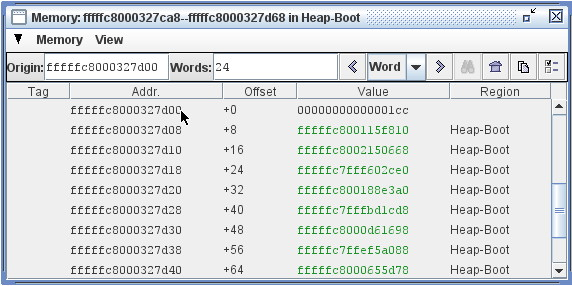

A Memory Inspector can be created in several ways:

-  The *Inspect memory at address...* entry in the
   standard `Memory menu <#menus>`__ brings up a dialog in which a
   starting address for a new Memory Inspector may be entered.
-  The *Inspect this object's memory* entry in the Memory menu
   appearing on any `Object Inspector <#heap-objects>`__.
-  Clicking on the *Create cloned copy...* button in the tool bar of
   any existing Memory Inspector; this creates a new Memory Inspector
   whose location is identical to the original, but whose subsequent
   behavior is independent of the original.
-  Dragging any `Memory Word Value <#memory-word-values>`__ to the
   Inspector's background; if the value can be interpreted as a memory
   location known to be allocated, a new Memory Inspector will be
   created started at that location.
-  Dragging the display of any `Memory Region <#memory-regions>`__ name
   (for example, any name displayed in
   a `Memory Region Column <#memory-regions>`__) to the Inspector's
   background; a new Memory Inspector will be created whose display
   spans the entire region.

Note that the Memory Inspector depicted in this example is currently in
Word mode, as indicated by the pull-down selector in the Inspector's
tool bar.
In this mode the Back and Forward arrow buttons serve to relocate the
viewing region of the Memory Inspector forward or backward one word at a
time.
The operation of the arrow buttons in other modes (Object and Page
modes) is discussed in subsequent sections.
Navigation also takes place in response to the scroll bar and by
resizing the window.

origin
^^^^^^

Every Memory Inspector maintains a current *origin* at all times; this
is a word-aligned memory address from which the locations displayed in
the ``Offset`` column are computed.
When a Memory Inspector is created, the *origin* is set initially to the
first word of the memory being displayed, but the location of the origin
is thereafter unconstrained.
Commands in the Memory Inspector's View menu, or direct editing of the
``Origin`` field, allow the origin to be set elsewhere.

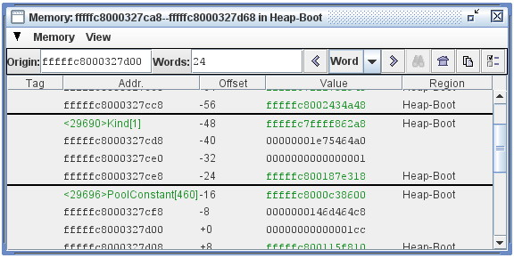

In this example, the displayed memory region is the same as the previous
example, but the *origin* has been set to a location in the middle of
the displayed region.

This example also shows the graphical separators that are applied by the
Memory Inspector whenever it discovers `Heap Object <#heap-objects>`__
boundaries in VM memory.

"Object" mode
^^^^^^^^^^^^^

Navigation in the Memory Inspector is modulated by the mode currently
selected via a pull-down selector in the Inspector's tool bar, located
between the Back and Forward arrow buttons.

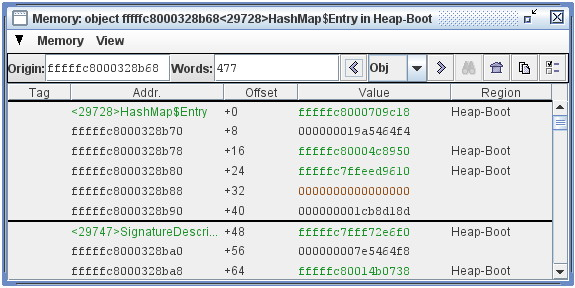

In this example the mode is set to Object, which causes the ``Back`` and
``Forward`` buttons to move backward and forward one object at a time,
assuming any objects can be located.
Each Object-mode move resets the Inspector's origin to the first word of
the object's representation and scrolls until that position is in the
first viewing position.

These moves do not change the size of the region being displayed, nor do
they cause the window to resize around the current object being
displayed.

"Page" mode
^^^^^^^^^^^

Navigation in the Memory Inspector is modulated by the mode currently
selected via a pull-down selector in the Inspector's tool bar, located
between the ``Back`` and ``Forward`` arrow buttons.

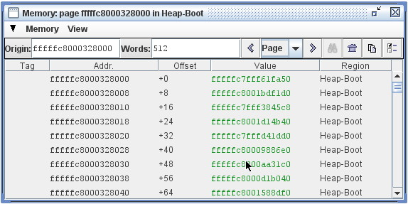

In this example the mode is set to ``Page``, which can be very helpful
when working on page-based mechanisms in the VM, for example garbage
collection.
In this mode the size of the region is constrained to equal the page
size of the platform, and the origin is constrained to location at page
boundaries.
Navigation via the ``Back`` and ``Forward`` buttons relocates the viewing
region by one page per click.

Manually changing either the ``Origin`` or ``Words`` size fields causes the
mode to revert to Word.

View options
^^^^^^^^^^^^

The Memory Inspector provides a number of options for displaying word
contents under different interpretations, available via the *View Options* entry in the Inspector's *View* menu.
The options dialog can also be invoked by clicking on the rightmost
button in the tool bar.

In the example below, all optional columns are displayed. Each column
displays the memory contents under a different interpretation: as Bytes,
as Chars, as Unicode, as a single-precision Float, and as a
Double-precision float.

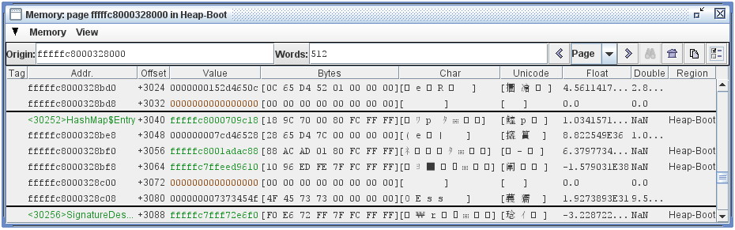

The Memory Bytes Inspector
^^^^^^^^^^^^^^^^^^^^^^^^^^

There are times when low-level memory inspection in terms of words, the
only mode supported by the standard
`Memory Inspector <#default-%22word%22-mode>`__ described above, is not
flexible enough for the task at hand.
In these situations the Memory Bytes Inspector, shown in the example to
the right, offers a much more flexible alternative.

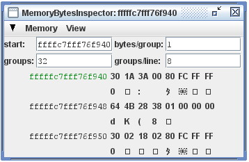

This Inspector can be configured to display memory at any location
(address, length), and can display memory in any grouping of bytes.

In the special case where bytes appear in groups of 1, as in the
example, each byte is also interpreted as an ASCII character. In the
special case where bytes appear in groups of 2, each group is also
interpreted as a UNICODE character.

In the special case where the address of a byte group is determined
empirically to be a valid reference to either a heap object or code,
this information can be displayed symbolically.
In the example at the right, the Memory Bytes Inspector has observed
that the address of the first group points to an object and has color
coded the display to indicate that.
See `Memory Word Values <#memory-word-values>`__ for more details.

A Memory Bytes Inspector can be created in several ways:

-  The *Inspect memory bytes at address...* entry in the standard
   Memory menu brings up a dialog in which a starting address for a new
   Memory Bytes Inspector may be entered.
-  The *Inspect memory at Origin as bytes* entry in the View menu
   appearing on any Memory Inspector.
-  A right mouse-click over the Tag column in most memory-based views
   will produce a popup menu, one entry of which is Inspect this memory
   as bytes.

Memory Regions
~~~~~~~~~~~~~~

The Maxine VM allocates memory in regions dedicated to various
subsystems.
These regions are given names for the purposes of inspection, and the
Inspector provides two mechanisms for observing this aspect of of the
VM's runtime state:
`the Memory Regions Inspector <#the-memory-regions-inspector>`__ and
`the Memory Regions Column <#the-memory-regions-column>`__, which can be
optionally displayed with many of the other Inspector Views.

The Memory Regions Inspector
^^^^^^^^^^^^^^^^^^^^^^^^^^^^

The Memory Regions Inspector displays a tabular summary of every
currently allocated region of memory in the running Maxine VM, with the
following columns displayed by default:

-  *Tag*: a place where additional information about the memory region
   can be displayed.
   In the example to the right the Tag entry in the second row notes
   that register R14 currently points into the region
   ``Thread-2 Locals``.
   The Tag column also highlights any memory region where one or
   more `Watchpoints <#watchpoints>`__ are set.
   Many Inspectors have a similar Tag column.
-  *Name*: a human readable name that describes its purpose.
   In the example the two regions named Heap-Boot and Heap-Code are
   preconfigured as part of the binary boot image
   (see `Boot Image Inspector <#boot-image-configuration>`__), each in
   the
   runtime format of the dynamic heap and code regions respectively.
   Additional regions are allocated dynamically for code compiled at
   run time, for example the region named Code-Runtime.
   Specific heap implementation allocate memory according to a garbage
   collection scheme, for example the Heap-From and Heap-To regions
   allocated by a semi-space collector.
   Finally, a region of memory for the VM's internal
   `Thread Local Storage <#thread-locals>`__ is allocated for each
   thread,
   named after the particular thread's ID.
-  *Start*, *End*: location of the region, expressed as hexadecimal
   memory addresses.
-  *Size*: number of bytes contained in the memory region, expressed by
   default in headecimal, but with additional formats available in
   mouseover Tooltip text.
-  *Alloc*: the percentage of the region that has actually been used by
   the particular subsystem owning the region, if this can be
   determined.

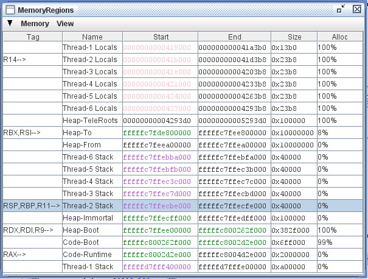

In the special case where a *Start* or *End* address is determined
empirically by the Inspector to be a valid reference to known kinds of
information, this information can be displayed symbolically.
In the displayed example, the addresses colored green have been
determined to point at heap objects, and the addresses colored magenta
have been deteremined to point into thread local storage.
Additional behaviors are available at such address display: mouseover
Tooltips, mouse left-click, and mouse right-click (all of which are
described in more detail in the field values section for
`Heap Objects <#heap-objects>`__).

Dragging a hexadecimal address from the *Start* or *End* columns onto
the Inspector background causes a
`Memory Inspector <#the-memory-inspector>`__ to be created starting at that
location and having a small default display span.
Dragging a name from the *Name* column causes a Memory Inspector to be
created whose span is the entire extent of the region.

The Memory Regions Column
^^^^^^^^^^^^^^^^^^^^^^^^^

Most Inspector views offer multiple columns of display information, only
a few of which may be visible by default.
The View Options menu item, available in the standard
`View menu <#menus>`__, allows user selections of visible columns.
This setting is persistent, and it can also be set as a
`User Preference <#user-preferences>`__.

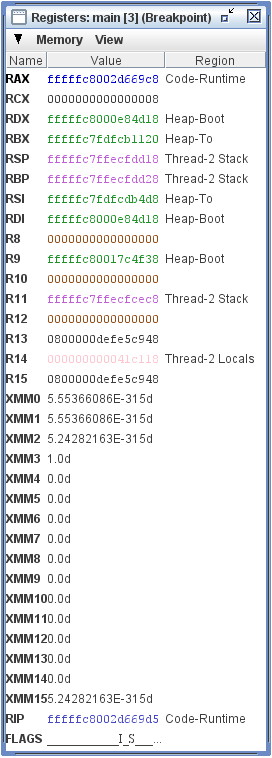

Every Inspector that display memory values of any kind offers an
optional column with the title *Region*.
In the example to the right, the `Registers Inspector <#registers>`__ is
shown with the Memory Regions Column visible.

The Memory Regions Column display is based on a Memory Word Value
associated with the particular row.
If the Word Value is determined to point to a valid location somewere in
the runtime state of the VM, the name of the memory region into which it
points is displayed.
If the Word Value does not point into a valid memory location, or if it
is a different kind of value display, then the The Memory Regions Column
is blank.

In the example several of the Word Values point to heap objects: some to
objects in the Boot Heap memory region
(see `Boot Image Inspector <#boot-image-configuration>`__), and some to the
dynamic heap region Heap-To allocated by the
`semi-space garbage collector <http://en.wikipedia.org/wiki/Cheney%27s_algorithm#Semispace>`__,
one of several implemented in the Maxine VM.
Some values point into the VM's allocation for particular
threads.
Finally, the RIP register, which is assumed to point into executable
code, does indeed point into a compiled method, as shown by the display
in symbolic mode.

Dragging a hexadecimal address from the Value column onto the Inspector
background causes a Memory Inspector to be created starting at that
location and having a small default display span.
Dragging a name from the Region column causes a Memory Inspector to be
created whose span is the entire extent of the region.

Heap Objects
~~~~~~~~~~~~

A Maxine Object Inspector displays the contents of a single heap object
as a sequence of name/value tuples with additional display
options.
Variant object representations in the VM are displayed with slightly
different kinds of Object Inspectors: tuples (ordinary objects), arrays,
and a special hybrid object used in the VM implementation that cannot be
expressed as a Java type.
Furthermore, certain common types can be displayed in multiple modes,
for example the contents of a ``char[]`` might alternately be displayed as
a string.

View a short demo `here <https://youtu.be/kMo1-zBQh28>`__, or see below for
examples and discussion of the heap object inspector's behavior.

Note that the design of Heap Object Inspectors has changed since the
demo video.
There are many additional display features and options.

Inspecting tuple heap objects
^^^^^^^^^^^^^^^^^^^^^^^^^^^^^

Ordinary objects are referred to as Tuples in the Maxine VM
implementation The first example window at the right displays the
contents of a simple object of type
``com.sun.max.vm.heap.BootHeapRegion``.
The object is visualized as a simple list of *Field*/*Value* tuples.
In this example, all other view options for the objects are turned off.

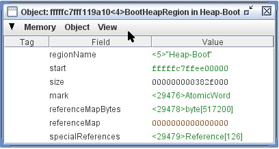

A basic Heap Object Inspector such as this one displays the following
elements of a tuple:

-  *Title Bar*: The window frame displays a compact string identifying
   the object: absolute address in memory, an integer ID for the object
   that is unique for the duration of the inspection, followed by the
   type of the object (as an unqualified class name) and the
   `Memory Region <#memory-regions>`__ in which it resides.
-  *Menu Bar*: The `Standard Menus <#menus>`__ relevant to the Object
   Inspector.
-  *Tag* column: The Inspector annotates each field with
   meta-information that may relate to other aspects of VM state or to
   the interactive state of the inspection session.
   For example, an annotation lists the names of all machine
   `Registers <#registers>`__ in the currently selected thread
   that point at the location represented by the row.
   A graphical annotations marks the locations of active
   `Watchpoints <#watchpoints>`__ for debugging.
   A mouse double-left-click in the Tag column toggles on and off the
   watchpoint at the specified location.
   A mouse right-click in the Tag column displays a menu of actions
   relevant to the specific memory location.
-  *Field* column: All fields in the object, local or inherited, appear
   one per row, with the unqualified field name appearing in this
   column.
   A mouseover Tooltip reveals the type of the field and the class in
   which it is declared; both names in the ToolTip are fully qualified.
-  *Value* column: The contents of object fields are read from the VM
   memory each time the VM halts.
   The values are displayed with numerous visual and interactive
   behaviors that depend on the value and the context of their
   appearance.
   See `Memory Word Values <#memory-word-values>`__ for details.

Ordinary Java object, such as the one in this example, are represented
in the Maxine VM heap as Tuples.
There are two other general kinds of objects in the Maxine heap, for
which Object Inspector behavior differs somewhat, as described below:
`Arrays <#array-objectss>`__, corresponding to ordinary Java arrays, and
`Hybrids <#hybrid-objects>`__, types specialized for the Maxine VM
implementation that do not correspond to any Java type.

Object Inspector view options
^^^^^^^^^^^^^^^^^^^^^^^^^^^^^

View options are available available by selecting the View Options entry
from the View menu.
A dialog permits the request for additional kinds of information, either
for the current Object Inspector only or for all subsequently created
Object Inspectors.
The setting for all subsequently created Object Inspectors is
persistent, and it can also be set via the Preferences action
(see `User Preferences <#user-preferences>`__).
The following example displays a heap object of type BootHeapRegion with
all view options turned on.

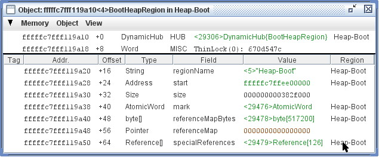

This example displays the same object as the previous example, but with
every kind of optional view information enabled.
These are listed below, not including the basic display features already
described above.

-  *Object header*: The Maxine VM implementation of heap objects adds
   an additional two or three fields in the object representation's
   header.
   In the case of simple objects such as this one, the two fields
   include a reference to the Maxine information (represented as Java
   objects) concerning the class of the object, followed by a word of
   bit fields used for a variety of purposes, including locking.
   A third, when present, specifies the length of the array part of an
   object (see `Array Objects <#array-objects>`__)
   and `Hybrid Objects <#hybrid-objects>`__ below).
-  *Addr.* column: displays the absolute current location of the field
   in VM memory, which may change when the heap is managing by a
   copying garbage collector.
   A mouseover Tooltip over this column displays the field's offset
   from the beginning of the object, the same information displayed in
   the Offset column.
   A mouse right-click over an address produces a menu with standard
   commands for copying the value onto the clipboard and creating a
   `Memory Inspector <#the-memory-inspector>`__ at this location.
-  *Offset* column: displays the field's location relative to the
   origin of the object, where the object layout is determined by a
   Maxine scheme.
   In this example, the object layout assigns the origin to memory
   location 0 in the representation of the object.
   A moueover Tooltip displays the field's absolute memory location,
   the same information displayed in the optional Addr.
   column.
   A mouse right-click over this column produces a menu with standard
   commands for copying the value onto the clipboard and creating a
   `Memory Inspector <#the-memory-inspector>`__ at this location.
-  *Type* column: displays the Java language type of the value,
   expressed as either Java primitive type names or unqualified Java
   class names.
   Mouseover Tooptips display symbolic information about the Maxine
   implementation of the type.
   A mouse right-click produces a menu of commands for inspecting Java
   objects related to the Maxine implementation of the type.
-  *Region* column: displays the name of the
   `Memory Region <#memory-regions>`__, if any, into which the value
   currently stored in the field points.
   See `Memory Regions Column <#memory-regions>`__.

Dragging a hexadecimal address from the Addr.
column onto the Inspector background causes a
`Memory Inspector <#the-memory-inspector>`__ to be created starting at
that location and having a small default display span.
Dragging a name from the Region column causes a
`Memory Inspector <#the-memory-inspector>`__ to be created whose span is
the entire extent of the region.

Arrays
^^^^^^

The Object Inspector displays slightly different information for objects
that the VM uses to represent Java arrays, as shown in the example.
This Inspector displays an integer array of length 11; a scroll bar
would appear when array length exceeds the size of the view window.

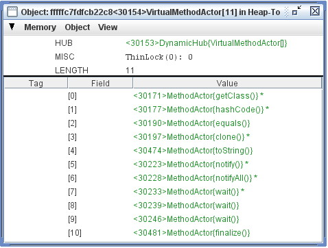

Array values are displayed exactly as for field values in ordinary tuple
objects: as `Memory Word Values <#memory-word-values>`__.
In the example, the values are references to objects of type
``MethodActor``.

This display differs from an ordinary
`Tuple Object Inspector <#inspecting-tuple-heap-objects>`__ in two ways.
First, the object header contains a third field that holds the length of
the array.
Second, the Field column identifies the index of each array element.

A mouse double-left-click in the Tag column sets a watchpoint at the
specified array element.

Other than the object header, all view options are turned off in this
display.
Standard view options are available for *Addr.*, *Offset*, *Type*, and
*Region* column.
These options are similar to the View Options available for ordinary
tuple objects and are available under the View Options entry in the
`View menu <#menus>`__.

An additional view option is available for array objects: suppressing
the display of ``null`` elements, where the definition of ``null`` depends
on the particular element type.
This can greatly improve visualization of sparsely populated arrays.

Hybrid objects
^^^^^^^^^^^^^^

For performance reasons, the Maxine VM stores much of its class-specific
implementation metadata in a special kind of heap object that has no
counterpart in the Java language.
These objects are *hybrids*: they contain fields, as with an ordinary
tuple object, but they also contain arrays dedicated to implementation
data that must be efficiently accessed when examining the representation
of an object.

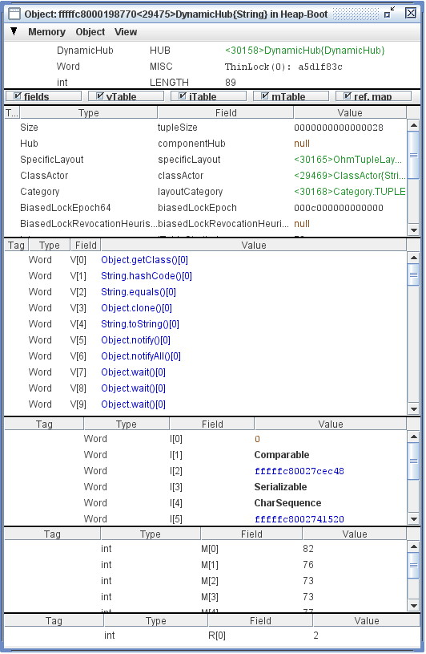

Each ordinary object's header, as shown in earlier examples above,
contains a pointer to the object's *Hub*, which is implemented in the heap
as a Maxine hybrid object.
The example shown to the right is a hybrid object representing the
*Dynamic Hub* for objects of type ``java.lang.String``.
Every ``String`` object in the heap contains a pointer to this hub.

Each class at runtime also contains static values, represented as an
object of the special type StaticTuple, whose metadata is contained in
an object of type StaticHub, also represented as a hybrid object.

Note in passing the following circularity: the Hub pointer of a
``DynamicHub`` points to the ``DynamicHub`` for class ``DynamicHub``.

Reflecting the complexity of hybrid objects, the Object Inspector
displays a hybrid as a collection of segments, each with different kinds
of information.

-  As with `Array Objects <#array-objects>`__, hybrids contain a word in
   the header that contains the total length of the array part of the
   object.
-  As with `Tuple Objects <#inspecting-tuple-heap-objects>`__, hybrids
   contain named fields, displayed in the fields segment of the Object
   Inspector.
-  The array segment of a hybrid us used to represent four kinds of
   information, and the Object Inspector displays each separately:
   ``vTable``, ``iTable``, ``mTable``, and ``Reference Map``.
   Each array segment behaves as for `Array Objects <#array-objects>`__.
-  Each array segment is individually scrollable, and each can be
   either displayed or hidden by using checkboxes at the beginning of
   the Object Inspector.

Specialized Object Inspectors
^^^^^^^^^^^^^^^^^^^^^^^^^^^^^

The Object Inspector can be specialized by adding alternate displays for
heap objects of particular types.
Several are currently in place, most of which display a textual summary
of the object's contents.

In two examples shown, a char array is shown to have such a specialized
alternate configured, evident by the appearance of window tabs that
select the display.
The standard array display appears in the upper example, while the
textual summary appears in the lower example.

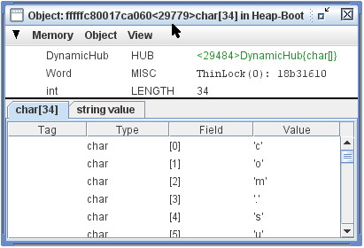
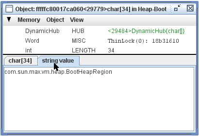

Object view canonicalization
^^^^^^^^^^^^^^^^^^^^^^^^^^^^

In ordinary operation, the Inspector creates at most one Object
Inspector per unique object in the VM's heap.
A user request to view an object, for example by clicking on a value
field that points at an object (see [Memory Word Values\|Inspector-Memory
Word Values), will cause a new Object Inspector to be created only if
one does not already exist; if one does exist, it is simply brought
forward and into full view.
The determination is made by comparing the memory location of the two
potentially identical objects.

In some situations, however, especially during garbage collection, the
Inspector may not be able to make this determination identity
correctly.
For example, a relocating garbage collector may create a copy of an
object's representation, and this relationship may not be detectable
immediately.
The Inspector is designed to sort this out as much as possible, most
importantly by stopping the VM at the conclusion of each GC cycle and
reviewing reviewing for duplications its table of VM heap objects.

This is work in progress, and the Inspector may not always get identity
sorted out correctly in every situation for every implementation of
garbage collection.

Machine Code
~~~~~~~~~~~~

A Maxine Method Inspector displays code associated with a method body in
several ways.
Here we show how machine code can be disassembled and displayed with
useful interactive behavior.

View a short demo `here <https://youtu.be/zkcPPkO7N5o>`__, or see below for
a discussion and screen snapshots of the Machine Code Inspector

Note that the design of Method Inspectors has changed somewhat since the
demo video.

Method Inspector with machine code
^^^^^^^^^^^^^^^^^^^^^^^^^^^^^^^^^^

The first example shows a Method Inspector displaying the disassembled
machine code for the Java method ``com.sun.max.vm.MaxineVM.run()``, which
is called by the VM at the conclusion of the startup sequence.
Display features include:

-  A *tab* that distinguishes the method inspector from others in a
   "tabbed window";
-  A *window header* that identifies the method in detail (which
   information is also available on the tab as a mouseover Tooltip);
-  A *suffix* to the name that identifies the specific compilation of
   the
   method; in the example the suffix "0" identifies the machine code as
   the first entry in the method's compilation history;
-  A number of *command buttons* for Debugging;
-  A dialog for setting *view options*, available from the *View...*
   button, in which specific display columns can be selected or
   deselected (the next example shows all columns);
-  A *Tag* column that displays markers related to Debugging, such as
   the triangular symbol for the current Instruction Pointer in the
   first row of the example;
-  A *Label* column that displays symbolic labels generated by the
   disassembler; information about the actual location in memory is
   available as a mouseover Tooltip in this column, and a menu of
   commands related memory locations is available via mouse right-click
   over this column;
-  An *Instruction* column displaying mnemonic machine operations, as
   configured for the target instruction set; and
-  An *Operands* column displaying mnemonics for machine code operands,
   as configured for the platform instruction set; in the special case
   where memory addresses appear in machine code operands, the
   inspector empirically determines whether the address points at a
   heap object or code entry, and if so, displays that information
   symbolically; additional display and interactive options are
   available over such references, as described in the Field Values
   section in `Heap Objects <#heap-objects>`__.

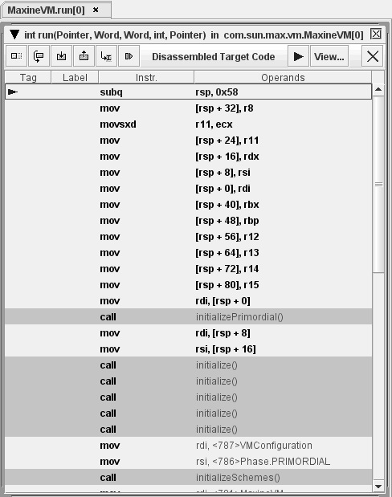

Optional display columns
^^^^^^^^^^^^^^^^^^^^^^^^

The second example window shows the same method inspection as the first,
but with all possible columns selected for view.
The addtional columns include:

-  An *Address* column displaying absolute memory location of the code,
   which information is also available via mouseover Tooltip on the
   *Label* column;
-  A *Position* column displaying memory location as a byte position
   relative to the beginning of the method, which information is also
   available via mouseover Tooltip on the *Label* column; and
-  A *Bytes* column that displays each instruction in raw bytes.

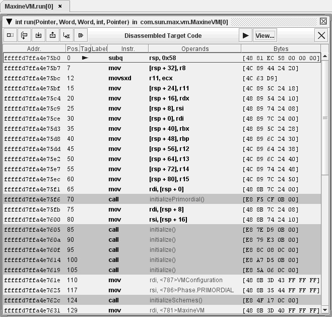

Bytecode
~~~~~~~~

A Maxine Method Inspector displays the code in a method body in several
ways.
Here we show how Java bytecode can be disassembled and displayed with
useful interactive behavior.

View a short demo `here <https://youtu.be/Z80MQhKmxVo>`__, or see below for
a discussion and screen snapshots of the Bytecode Inspector.

Note that the design of Method Inspectors has changed somewhat since the
demo video.

Method Inspector with bytecode
^^^^^^^^^^^^^^^^^^^^^^^^^^^^^^

The first example shows how the Method Inspector displays disassembled
bytecodes for the Java method ``com.sun.max.vm.MaxineVM.run()``, which is
called by the VM at the conclusion of the startup sequence.
Display features include:

-  A *tab* that distinguishes the method inspector from others in a
   "tabbed window";
-  A *window header* that identifies the method in detail (which
   information is also available on the tab as a mouseover Tooltip);
-  A number of *command buttons* for debugging;
-  A dialog for setting *view options*, available from the *View...*
   button, in which specific display columns can be selected or
   deselected (the next example shows all columns);
-  A *Tag* column that displays markers related to debugging, such as
   instruction pointer, call return site, and breakpoint;
-  A *Position* column that displays the byte offset at the beginning
   of each instruction, relative to the beginning of the code block;
-  An *Instruction* column displaying the mnemonic name of each
   bytecode instruction, as defined by the specification for the Java
   Virtual Machine; and
-  Two Operand columns displaying bytecode operands in a format based
   loosely on the examples in the book The Java Virtual Machine
   Specification and on the output of the command line disassembler
   javap; bytecode operands identifying constant pool entries that
   reference Java language objects are displayed symbolically, and the
   displays have useful display and interactive behavior; for example,
   a mouseover Tooltip displays the full Java description for the
   reference and identifies whether the reference has been resolved.

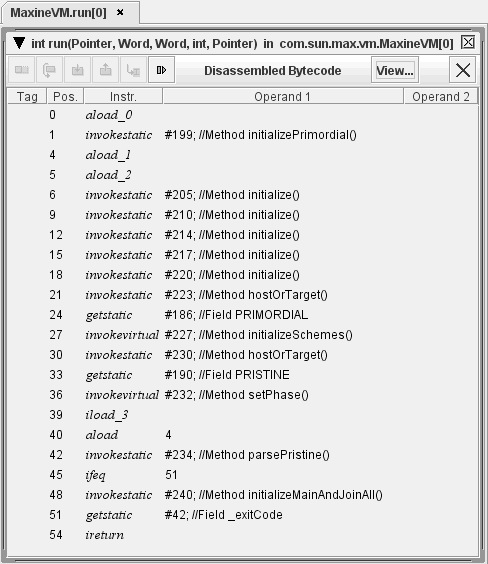

Optional display columns
^^^^^^^^^^^^^^^^^^^^^^^^

The second example window shows the same method inspection as above, but
with an additional column selected for view:

-  A Bytes column displays each instruction in raw bytes.

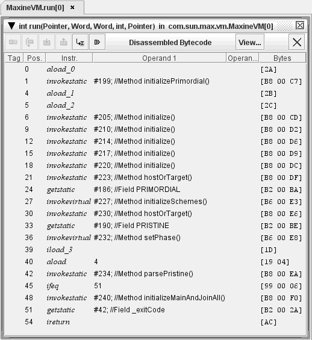

Multi-code Method Views
~~~~~~~~~~~~~~~~~~~~~~~

A Maxine Method Inspector displays the code in a method body in several
ways, and can do so in more than one way simultaneously.
Here we show how machine code and bytecode for a method body can be
viewed together.

View a short demo `here <https://youtu.be/w3wtObfMxd4>`__, or see below for
a discussion of the combined method views.

Note that the design of Method Inspectors has changed somewhat since the
demo video.

Method Inspector with machine code and bytecode
^^^^^^^^^^^^^^^^^^^^^^^^^^^^^^^^^^^^^^^^^^^^^^^

The example below shows the same method used in previous examples: Java
method ``com.sun.max.vm.MaxineVM.run()``, which is called by the VM at the
conclusion of the startup sequence.
In this view, both machine code and bytecode have been enabled, managed
via the menu available on the triangle at the upper left corner of the
Method Inspector.

It is possible to debug in a multi-code method view.
When a reliable map between machine code and bytecode locations is
available (currently true only for the Maxine VM's template-based JIT
compilations), the Instruction Pointer location will be visible in both
views and will track correctly during single stepping.
`Breakpoints <#breakpoints>`__ can be set in either code view, although the
detailed behavior of the breakpoints may differ in some situations.

[STRIKEOUT:A third option, to display source code, will be added.]

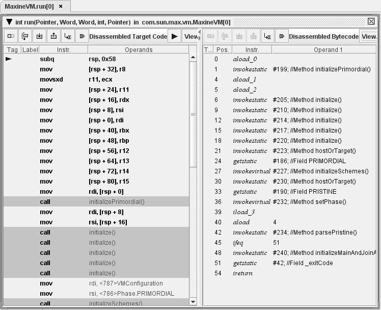

Threads
~~~~~~~

The Threads Inspector is one of the Maxine Inspector's tools for
examining machine state during execution of the Maxine VM.
It also serves to change the focus of other, thread-specific views in
the Inspector: `Thread Locals <#thread-locals>`__, `Registers <#registers>`__,
and `Stacks <#stacks>`__.

View a short demo `here <https://youtu.be/Ar23wSORs-Q>`__, or see below for
a discussion and screen snapshot of the Threads Inspector.

Note that the design of the Thread Inspector has changed somewhat since
the demo video.

The Threads Inspector
^^^^^^^^^^^^^^^^^^^^^

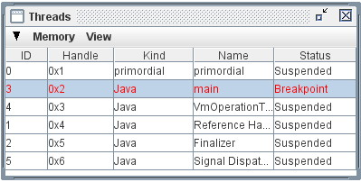

The Threads Inspector displays a table of basic information about each
thread that exists in the VM process, including by default the following
columns:

-  *ID*: a numeric identifier associated with the native thread in the
   underlying OS.
-  *Handle*: a numeric identifier associated with Java threads managed
   by the Maxine VM.
-  *Kind*: a string identifying the kind of thread, for example "Java"
   for threads created and managed by the VM, "primordial" for the the
   special native thread used to bootstrap the VM, and no name for
   other native threads.
-  *Name*: a human-readable string assigned by the VM to describe the
   role of the thread, for example those showing in the window include
   the main Java thread, Java utility threads for reference management
   and finalization, and the special native thread used to bootstrap
   the VM which we call the "primordial" thread.
-  *Status*: describes what is known about the state of the thread, for
   example "Suspended" or at "Breakpoint".

Aside: There is no thread in a Maxine VM that either runs or supports
the Maxine Inspector, a crucially important design decision for enabling
the debugging of low level VM mechanisms.
The Inspector runs in a separate process and communicates with the VM
process in an OS-specific fashion, for example via "libproc" in Solaris.

The current thread selection
^^^^^^^^^^^^^^^^^^^^^^^^^^^^

A mouse left-click on one of the rows causes the displayed thread to
become the "current thread selection" shared by all tools in the
Inspector (see `User Focus <#user-focus>`__).
Several Inspector views display thread-specific information, based on
the current thread selection: the
`Thread Locals Inspector <#thread-locals>`__, the
`Registers Inspector <#registers>`__, and the `Stack Inspector <#stacks>`__.
Furthermore, most memory-based views contain a *Tag* column in which
each row may contain the name of any registers for the currently
selected thread that point into the memory designated by the row.

Thread Locals
~~~~~~~~~~~~~

The Maxine VM allocates an internal Memory Region for each Thread that
is used to store implementation data that is private (or "local") to the
threads implementation.
This storage is not to be confused with thread-local storage provided as
part of the Java programming model.

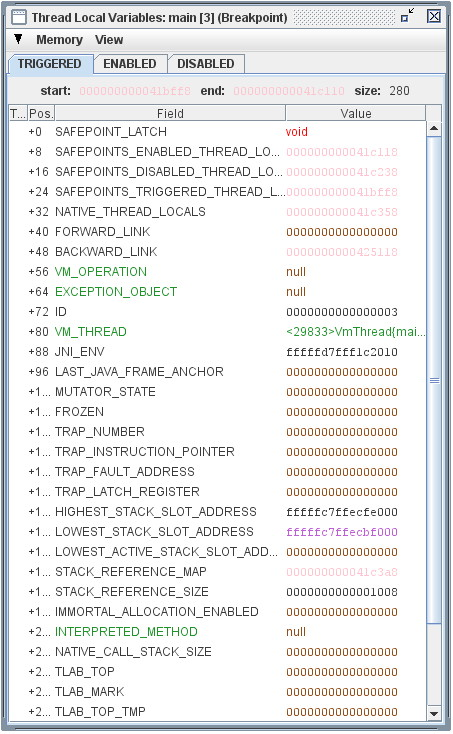

The VM's Thread Local Variables for the currently selected thread
(see `Threads <#threads>`__) are displayed by the Thread Locals Inspector,
as shown in the example to the right.
These variables are part of each thread's internal implementation, in
the form of word-length name-value pairs described by default with the
following columns:

-  *Tag*: as with other memory-related views, the *Tag* column displays
   the names of any registers for the currently selected thread that
   currently point at the row's memory location, as well as the
   possible presence of a `Watchpoint <#watchpoints>`__.
   A mouse double-left-click in the Tag column sets a watchpoint at the
   specified location.
-  *Pos*.: the offset of the local variable slot from the beginning of
   the variable set, specified in bytes.
-  *Field*: the name by which the VM's internal implementation knows the
   particular thread-local variable.
   A mouseover Tooltip displays a documentation string, specified in
   the VM's implementation, that describes the role of the variable in
   human-readable form.
-  *Value*: the current contents of each word using techniques
   described elsewhere (see `Memory Word
   Values <#memory-word-values>`__).

The selection of visible columns can be selected using a dialog created
by the View Options entry in the Inspectors View menu.
Additional columns available include Address and the standard
`Memory Region Column <#memory-regions>`__.

Note that the Maxine VM implementation maintains three copies of the
thread locals, identified by the three tabs that select which one to
view: ``TRIGGERED``, ``ENABLED``, or ``DISABLED``.

Registers
~~~~~~~~~

The Registers Inspector is one of the Maxine Inspector's tools for
examining machine state during execution of the Maxine VM.

View a short demo `here <https://youtu.be/KXNwJy1VidA>`__, or see below for
a discussion and screen snapshot of the Registers Inspector.

Note that the design of the Registers Inspector has changed since the
demo video.
Most significantly, is no longer possible to set the current thread
selection from the Registers Inspector; the tabs at the top of the view
have been removed.
Thread selection is now done only from the
`Threads Inspector <#threads>`__.

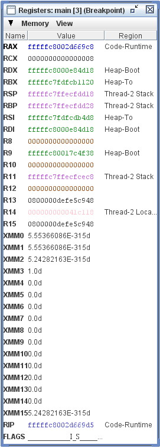

The Registers Inspector displays the register contents in the VM for the
thread that is currently selected in the Threads Inspector.
The name, ID, and state of this thread appear in the title bar of the
Registers Inspector window.

The Registers Inspector displays a list of name/value tuples, described
by the following columns that appear in the example to the right:

-  *Name*: a string identifying the register, derived from an
   architectural description of the target machine for which the VM was
   built.
-  *Value*: the current contents of the registers, refreshed by reading
   from the VM process each time the VM halts.
   Number-valued register values are displayed with numerous visual and
   interactive behaviors that depend on the value, as described
   elsewhere (see `Memory Word Values <#memory-word-values>`__).
-  *Region*: the standard, optional
   `Memory Region Column <#memory-regions>`__, which identified the
   known
   memory region, if any, into which the current register value points.

When a register changes value after a VM execution (either by single
step or by running to a breakpoint), attention is drawn to that register
in this Inspector by coloring the Name in red.
With each successive execution of the VM, as the value ages, the
register name migrates from red, though magenta, then blue, and finally
black.

A mouse middle-button click over one of the values in XMM registers
cycles the Value display through three modes: hexadecimal,
single-precision float, and double-precision float;
(see `Memory Word Values <#memory-word-values>`__).
Since the VM only uses the lower 64 bits of XMM registers, the inspector
display only this part.

The selection of visible columns can be made using a dialog created by
the View Options entry in the Inspectors View menu.
Additional columns available include Address and the standard Memory
Region Column.

Stacks
~~~~~~

The Stack Inspector is one of the Maxine Inspector's tools for examining
machine state during execution of the Maxine VM.

View a short demo `here <https://youtu.be/cveHrtXUhug>`__, or see below for
a discussion and screen snapshot of the Stack Inspector.

Note that the design of the Stack Inspector has changed since the demo
video.
Most significantly, it is no longer possible to set the current thread
selection from the Stack Inspector; the tabs at the top of the view have
been removed.
Thread selection is now done only from the
`Threads Inspector <#threads>`__.

The Stack Inspector displays the stack and currently selected stack
frame in the VM for the thread that is currently selected in the Threads
Inspector.
The name and status of this thread appears in the title bar of the Stack
Inspector window.

.. image:: images/Inspector-Stack.jpg

Each Stack Inspector displays several kinds of information:

-  The *Memory location* of the stack is expressed at the top of the
   display as a start memory address, expressed in hexadecimal, and
   ``size`` in bytes in the VM.
-  The middle of the display lists the *stack frames* currently on the
   stack, identified by unqualified method name and compilation
   sequence identifier.
   The currently active method appears at the top; native code about
   which nothing is known is identified by memory address of the
   entry.
   The stack can have a single *selected frame*, ``HelloWorld.main()0``
   in the example, selected with a mouse left-click over the list
   entry.
-  The bottom pane of the display describes the currently selected
   stack frame, including a list of slots contained in the frame.

Selecting a stack frame causes it to become the *currently selected stack frame* (see `User Focus <#user-focus>`__).
It has the side effect of creating a Method Inspector for the method
with a `Machine Code view <#machine-code>`__, a `Bytecode view <#bytecode>`__,
or both, depending on user preferences and availability of the two
representations.

The currently selected stack frame
^^^^^^^^^^^^^^^^^^^^^^^^^^^^^^^^^^

The contents of the currently selected stack frame appear at the bottom
of the view, beginning with specific information concerning the size of
the frame and certain key pointers: ``FP``, ``SP``, and ``IP``.
Below those appears a list of the stack slots in the frame, described by
default using three columns:

-  *Tag*: as with Tag columns in other Inspectors, lists any registers
   in
   the currently selected thread that point at this location, along
   with a possibly set `Watchpoint <#watchpoints>`__.
   A mouse double-left-click in the Tag column sets a watchpoint at the
   specified location.
-  *Name*: a symbolic name of the slot, derived from internal
   descriptions of the frame layout.
-  *Value*: the current value in the memory location, refreshed from VM
   memory after each execution; displayed with numerous visual and
   interactive behaviors that depend on the value, as described
   elsewhere (see `Memory Word Values <#memory-word-values>`__).

The selection of visible columns can be made using a dialog created by
the View Options entry in the Inspectors View menu.
Additional columns available include *Address*, *Offset*, and the
standard `Memory Region Column <#memory-regions>`__.

Breakpoints
~~~~~~~~~~~

Debugging with the Maxine Inspector is facilitated by a polymorphic
approach to code breakpoints that is still very much under
development.
Just as code can be viewed in more than one way
(`Machine Code <#machine-code>`__, `Bytecode <#bytecode>`__, and eventually
source code - see `Multi-code Method Views <#multi-code-method-views>`__,
debugging will likewise be carried out in terms of more than one level
of code view.

View a short 2008 demo `here <https://youtu.be/Gneh5xl1eoM>`__, or see
below for a discussion and screen snapshot of the Breakpoints Inspector.

Note that the design of the Breakpoints Inspector has changed somewhat
since the demo video.

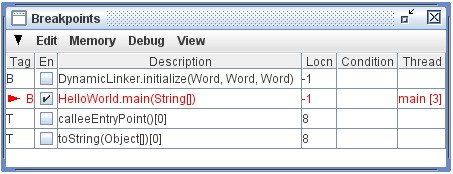

The Breakpoints Inspector lists all breakpoints that exist in the
current session and displays their status, by default with the following
columns:

-  *Tag*: specifies whether the breakpoint is expressed in terms of a
   machine code (method compilation) location in memory ("T") or as a
   bytecode location ("B").
   The implementation of bytecode breakpoints is incomplete at this
   time, and source code breakpoints are not yet supported.
   The column also displays a pointer at the breakpoints, if any, that
   currently have blocked a thread.
-  *En*: a checkbox that can be used to enable/disable a specific
   breakpoint.
-  *Description*: identifies the Java method in which the breakpoint is
   set, and a mouseover Tooltip provides more detailed information.
-  *Locn*: describes the position in the method code at which the
   breakpoint is set, expressed in bytes from the method entry.
   A value of -1 denotes abstractly the entry of a method, even if
   little about the method is known.
-  *Condition*: an editable field in which an expression can be
   supplied that makes the breakpoint conditional, supported at present
   only for machine code breakpoints
-  *Thread*: identifies a thread, if any, that is currently stopped at
   the breakpoint.

A mouse left-click over a row in the Breakpoints Inspector causes it to
become the currently selected breakpoint
(see `User Focus <#user-focus>`__).
It has the side effect of making the breakpoint's code location visible
in a Method Inspector showing the appropriate kind of code (machine code
or bytecode); it also selects the instruction at that location.
A special colored box appears in the Tag column of a code view at the
location of a breakpoint.

Setting breakpoints
^^^^^^^^^^^^^^^^^^^

The Maxine Inspector provides a number of ways to set and clear (delete)
breakpoints:

-  commands on the standard `Debug menu <#menus>`__;
-  commands in the Edit menu on the Breakpoints Inspector's menu bar;
-  debugging command buttons on Method Inspector code views (for
   example mouse left-double-click over a code instruction; and
-  by keyboard shortcuts.

The semantics of machine code and bytecode breakpoints differ, most
notably because there can be 0, 1, or many compilations of a single
method.
A machine code breakpoint is anchored at a specific memory location in
the code region, and is thus in effect for only that specific
compilation, whereas a bytecode breakpoint should in principle be in
effect for every compilation of the method, current and future.

Breakpoints persist across sessions as long as the same boot image is
being used; that restriction may be eliminated in the future for some
kinds of breakpoints.

Watchpoints
~~~~~~~~~~~

Debugging with the Maxine Inspector is facilitated by a watchpoint
mechanism, supported on some platforms, that is currently under
development.
It is possible to place watchpoints that catch reads and/or writes
and/or executions taking places at specified memory locations.

Because debugging in the presence of relocating Garbage Collection is
especially problematic, the Inspector's watchpoint mechanism supports
specific features above and beyond conventional watchpoint behavior:

-  a watchpoint may be specified either in terms of an *absolute memory
   location* (the conventional mode) or in terms of a *specific object
   and its fields*.
   The latter are known as Maxine object watchpoints, and they will be
   automatically relocated by the Inspector when the object's
   representation in VM memory is relocated by GC.
-  a watchpoint may be configured to be either active or inactive
   during execution periods when GC is underway; this can help suppress
   spurious watchpoint triggers caused as a side effect of ordinary
   rearrangement of memory by GC.

The Watchpoints Inspector lists all watchpoints that exist in the
current session and displays their status, as shown in the following
example.

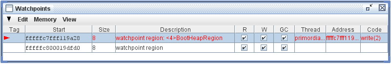

The columns visible in this example include:

-  *Tag*: displays a red pointer at the watchpoint, if any, that has
   blocked a thread.
-  *Start*: the VM memory address at which the watchpoint starts.
-  *Size*: the amount of memory in bytes covered by the watchpoint.
-  *Description*: a string describing how the watchpoint was created:

   -  "watchpoint region" if set only at a specified memory location, or
   -  containing a description of an object if set on one or more fields
      of an object; in this case the location of the watchpoint will be
      updated automatically whenever the representation of the object is
      moved in VM memory by GC.

-  *R*: a checkbox controlling whether the watchpoint should trigger
   when the memory location is read.
-  *W*: a checkbox controlling whether the watchpoint should trigger
   when the memory location is written.
-  *GC*: a checkbox controlling whether the watchpoint should trigger
   at all during VM execution periods when GC is operating.
-  *Thread*: the thread, if any, that triggered the watchpoint.
-  *Address*: the specific location, if any, that triggered the
   watchpoint.
-  *Code*: an indication of what action in the VM caused the trigger.

Optional display columns
^^^^^^^^^^^^^^^^^^^^^^^^

Additional columns may be displayed via a dialog produced by the *View Options* entry in the Inspector's `View menu <#menus>`__.
They include:

-  *X*: a checkbox controlling whether the watchpoint should trigger
   when the memory is read for execution, false by default.
-  the standard `Memory Region Column <#memory-regions>`__.

Setting watchpoints
^^^^^^^^^^^^^^^^^^^

Watchpoints may be created and managed in several ways:

-  using entries in the Edit menu on the Inspectors menu bar.
-  by mouse left-double-click over the Tag column in any view for which
   rows correspond to memory ranges.
-  using a menu produced by mouse right-click over the Tag column in
   any view for which rows correspond to memory regions.

Debugging
~~~~~~~~~

The Maxine Inspector supports a number of debugging features, most of
which leverage the views that have been described in other
segments. This section describes how to use those features to handle
some specific situations. More features for debugging and more
discussion of this topic are forthcoming.

Debugging Traps
^^^^^^^^^^^^^^^

To find out when a hardware trap happens, you can set a machine code
breakpoint in the responsible trap handler.
For example, when you are interested in ``SEGV`` signals, set a Breakpoint
in ``com.sun.max.vm.runtime.Trap.handleSegmentationFault()``, using the
menu item ``Debug → Break`` at ``Method Entry → Compiled Method...`` or its
keyboard shortcut ``CTRL-SHIFT-E``.
Once the VM is stopped at the breakpoint, remove it and place
breakpoints at every exit from the method (RET instruction on x64).
Then resume the process.

Once one of the latter breakpoints hits, the VM now has left information
about the trap in thread local storage where the inspector can pick it
up.
Select ``View → Stack`` from the menu.
This brings up a `Stack inspector <#stacks>`__ that shows the stack how it
was when the trap happened.
You can even find out which instruction was responsible by clicking on
the top frame.
The instruction will be highlighted by a blue selection border.

Note that the `Registers Inspector <#registers>`__ will not show register
values from the trap site, but the current register values in the trap
handler.

Since some exceptions (e.g. null pointer, divide by zero) are
implemented as implicit exceptions that are handled via traps, not every
trap is necessarily a VM crash, but it may also be normal operation.

To observe divide-by-zero traps, use a different trap handler, then
apply the same procedure as above.

Debugging through a Garbage Collection
^^^^^^^^^^^^^^^^^^^^^^^^^^^^^^^^^^^^^^

If you set a breakpoint inside the GC implementation and suspend the VM
there, you may find that some object references are no longer
functioning.
The Inspector detects when a GC is underway and then distinguishes
references into the boot image from those into the runtime heap.
Whereas the former are immutable and always intact, the latter are
considered broken during GC.
Where ever they appear in fields, array elements etc.
they change in color from green to red and most interaction with them is
disabled.

Once the GC has finished, the Inspector refreshes all the red references
and they become green and fully functional again.

Native Code
~~~~~~~~~~~

The Inspector provides some limited support for debugging native code
that is either included in the VM image or loaded dynamically by user
code, e.g., with ``System.loadLibrary``.

The Code menu provides an entry View native function by name.
This initially brings up a dialog with a list of loaded libraries, for
example, ``libjvm`` which contains the native code that supports the VM.
Selecting a library then brings up a list of functions defined in the
library.
Selecting a function then brings up a code view for that function.
These dialogs behave similarly to those for Java methods so that name
filtering, for example, works as expected.
Note that if this menu entry is invoked before a symbol lookup in the
library has occurred, the addresses of the functions in a library will
not be known.
In this case a dialog with the text "Functions are not available at this
stage" is displayed.
This window is usually very short and is unlikely to be encountered in
practice.

A breakpoint may be set at the entry to a native function by the ``Debug -> Break`` at ``machine code -> Native function``, which brings up similar
dialogs.

There is currently no support for symbolic display of instructions
within a native function, and stack walking is not implemented within a
chain of nested function calls.

Notepad
~~~~~~~

The Inspector provides a persistent notepad for the user's
convenience.
The notepad contains an arbitrary collection of text that the user can
manage and which endures across restarts of the Inspector.
A small amount of specialized behavior driven by the contents of the
notepad is supported, and this may be extended in the future.

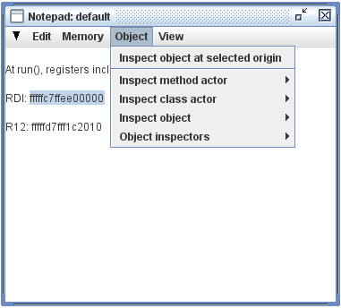

Viewing and editing access to the Inspector's notepad is provided by the
Notepad Inspector, an example of which appears to the right.
This Inspector is a very simple text editor whose single buffer is
implicitly persistent; it need not be explicitly saved, and it will
always endure across Inspector sessions.

Text in the Editing commands include the familiar *Cut*/*Copy*/*Paste*
commands, which interoperate with the same system clipboard used by the
rest of the Inspector and which are available in three ways:

-  from entries on the Inspector's Edit menu;
-  from entries on a menu that pops up in response to a mouse
   right-click over the editing area; and
-  from conventional keystroke accelerators, which are noted in the
   menu entries.

Specialized behavior
^^^^^^^^^^^^^^^^^^^^

Additional specialized behavior is available when a selected range of
text can be interpreted as a memory address expressed in hexadecimal, as
is the selection in the example:

-  the commands *Inspect memory at selected address* and *Inspect
   memory region containing selected address* become enabled and can
   create `Memory Inspectors <#the-memory-inspector>`__ as suggested by
   their names.
   These commands appear on a menu that pops up in response to a mouse
   right-click over the editing area and as context-specific additions
   to the standard `Memory <#the-memory-inspector>`__ menu on the menu
   bar.
   When the selection cannot be interpreted as a memory address, the
   commands are disabled and grayed out.
-  when the selected range of text can be interpreted as a memory
   address that is the origin of a VM `Heap Object <#heap-object>`__,
   the
   command *Inspect object at selected origin* becomes enabled and can
   create an `Object Inspector <#heap-objects>`__ displaying the
   object's
   representation.
   This command appears on a menu that pops up in response to a mouse
   right-click over the editing area and as a context-specific addition
   to the standard `Object menu <#menus>`__ on the menu bar (see
   example).
   When the selection cannot be interpreted as a memory address that
   points at an object origin, the command is disabled and grayed out.

User Focus
~~~~~~~~~~

The views (known as individual "Inspectors") available within the Maxine
Inspector make visible many different aspects of the VM state (see, for
example, the Inspectors listed on the standard View menu), and many of
them support some kind of user-driven selection.
Some selections have side effects that cause other Inspector views make
visible information related to the selection; in other words, some view
actions are coordinated by user selections.
The mechanism for this coordination is the *user focus*.
When the description of an Inspector refers to the *currently selected X*, for some kind of VM entity X, it refers to the specific instance of
X that is set in the user focus.

Some user selections have the side effect of setting a *user focus*: a
selection that is shared among all Inspector views.
At present, such shared selections include:

-  `Thread <#threads>`__
-  `Stack Frame <#stacks>`__
-  Code Location (`Machine Code <#machine-code>`__,
   `Bytecode <#bytecode>`__,
   or both)
-  `Breakpoint <#breakpoints>`__
-  `Watchpoint <#watchpoints>`__
-  `Memory address <#the-memory-inspector>`__
-  `Heap Object <#heap-objects>`__

Strict View Coordination
^^^^^^^^^^^^^^^^^^^^^^^^

In the case of threads, the coordination among views is strict, so that
there is an invariant relationship among certain thread-specific views:

-  The `Registers Inspector <#registers>`__ only displays the registers
   for the *currently selected thread*.
-  The `Stack Inspector <#stacks>`__ only displays the stack and its
   stack
   frames for the currently selected thread.
-  The `Thread Locals Inspector <#thread-locals>`__ only displays thread
   local storage for the *currently selected thread*.
-  `Machine Code Inspectors <#machine-code>`__ and
   `Bytecode Inspectors <#bytecode>`__ display the instruction pointer
   and
   call return sites on the stack only for the *currently selected
   thread*.
-  Any *Tag* column in a memory-related view adds annotations only for
   registers in the *currently selected thread* that point into the
   row's memory region.

Another example of strict coordination occurs within the
`Stack Inspector <#stacks>`__.
The lower part of the Inspector only displays the stack frame slots for
the currently selected stack frame.

Relaxed View Coordination
^^^^^^^^^^^^^^^^^^^^^^^^^

Some selections that set the user focus have side effects on other
views, but there is no strong invariant of the sort mentioned above for
threads.
The goal of these side effects is to bring into user view some relevant
information about the entity just selected.
The specific nature of these rules is evolving, based on user
experience.
Examples include:

-  Selecting a frame in the `Stack Inspector <#stacks>`__ causes the
   *instruction pointer* in the frame (if the top frame) or *call
   return pointer* (if other than the top frame) to become the
   currently selected code location.
   This in turn causes the appropriate Method Inspector to display the
   method and select the code location in that view.
-  Selecting a breakpoint causes its location to become the currently
   selected code location, which in turn causes the appropriate Method
   Inspector to display the method and select the code location in that
   view.

Subsequent actions, for example selecting another code instruction, will
break these relationships.

The User Focus Inspector
^^^^^^^^^^^^^^^^^^^^^^^^

A specialized inspector displays the current members of the *user focus*
at any time.
In the example below, every aspect of the user focus is non-null, but
this is not always the case.

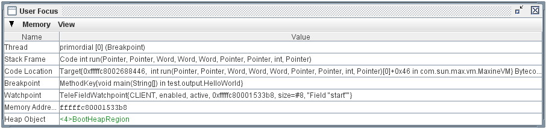

This Inspector is intended mainly for testing the Maxine Inspector
itself (which is why it appears only in the Test menu on the main menu
bar), but it can be useful to help understand unexpected interactions.

Menus
~~~~~

The Maxine Inspector displays menus in three contexts:

-  the *main menu bar*, which appears at the top of the entire
   application frame;
-  an *inspector menu bar* on each of the specific Inspector views; and
-  a *popup menu* that appears in response to a mouse right-click.

A distinguished set of *standard menus* can appear in many contexts and
have behavior that is generally independent of context.
In other words these menus have the same names, entries, and behavior no
matter where they appear.
The standard menus, described in more detail below, are named Memory,
Object, Code, Debug, and View.

Other menus have behavior that is generally dependent on context, for
example the Default menu that is accessible at the upper left of every
Inspector view under a triangle icon, and the Edit menu that appears on
Inspectors where the displayed contents can be modified in some way.

Finally, some menus are a combination of a standard menu with additional
context-dependent entries added before the standard entries, separated
by a horizontal separator.

The Main Menu Bar
^^^^^^^^^^^^^^^^^

The standard menus Memory, Object, Code, Debug, and View appear, among
others, in the main menu bar of the Inspector, as shown below:

.. image:: images/Inspector-MainMenuBar.jpg

Other menus, unique to the main menu bar include:

-  *Inspector*: general functionality, including Refresh all Views,
   Close all views, Preferences, and Quit Inspector.
-  *Java*: very specialized commands concerning the VM, for example
   setting tracing level in the VM.
-  *Test*: some commands specialized for debugging the Inspector.
   Most list some summary of internal state to the console.
   The exception, View User Focus, creates the User Focus Inspector,
   which summarizes all the aspects of current user focus, for example
   selected selected thread, stack frame, selected memory address, etc.
   See User Focus.
-  Helep: access to the Inspector's Help System would be here, if it
   had one.
   Sorry.

Inspector Menu Bars
^^^^^^^^^^^^^^^^^^^

Standard menus sometimes appear (when relevant) in the menu bar of
individual Inspector windows.
In such cases, the menus sometimes contains additional menu entries that
are dependent on the context of the particular view.
These context-dependent menu entries usually appear first on the menu,
followed by a line that acts as a separator, followed the the standard
context-independent entries.
For example, in the example display of
the `Notepad Inspector <#notepad>`__, the standard Object menu contains an
additional entry that is sensitive to the current text selection in the
notepad.

The Standard Memory Menu
^^^^^^^^^^^^^^^^^^^^^^^^

The standard Memory menu contains entries designed to create and manage
Inspectors related to low-level memory properties of the VM.
They include:

-  *Inspect memory region*: produces a dynamically generated submenu
   listing all known `Memory Regions <#memory-regions>`__.
   Selecting an entry produces a
   `Memory Inspector <#the-memory-inspector>`__ whose display spans the
   region.
-  *Inspect memory at address...*: produces a dialog in which a memory
   address can be entered, which in turn produces a
   `Memory Inspector <#the-memory-inspector>`__ whose display begins at
   the specified address.
-  *Inspect memory bytes at address...*: produces a dialog in which a
   memory address can be entered, which in turn produces a
   `Memory Bytes Inspector <#the-memory-inspector>`__ whose display
   begins at the specified address.
-  *Memory inspectors*: produces a dynamically generated submenu
   listing all existing `Memory Inspectors <#the-memory-inspector>`__.
   Selecting an entry brings the Inspector window to the foreground.
-  *View Memory Regions*: produces
   the `Memory Regions Inspector <#memory-regions>`__.
   This entry also appears on the standard View menu.

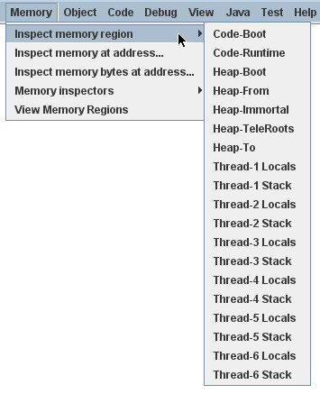

As with all standard menus, the standard Memory menu also appears on
some individual Inspector windows.
When it does appear, it often contains some additional entries that are
context-dependent, which is to say their behavior depends on the
particular Inspector in which it appears.
For example, each `Object Inspector <#heap-objects>`__ adds the entry
*Inspect this object's memory*, which produces
a `Memory Inspector <#the-memory-inspector>`__ whose display spans the
representation of the object being inspected.

The Standard Object Menu
^^^^^^^^^^^^^^^^^^^^^^^^

The standard Object menu contains entries designed to create and manage
Object Inspectors.
They include:

-  *Inspect method actor*: produces a dialog that permits
   identification (by name) of a Java method presumed to be loaded into
   the VM.
   If so, this produces an `Object Inspector <#heap-objects>`__ on the
   special VM object (of type MethodActor) that the VM uses to
   represent information about the method.
-  e: produces a dialog that permits identification
   (by name or ID) of a Java class presumed to be loaded into the
   VM.
   If so, this produces an `Object Inspector <#heap-objects>`__ on the
   special VM object (of type ClassActor) that the VM uses to represent
   information about the class.
-  *Inspect object*: produces a dialog that permits identification of a
   Java object (by address or Inspector session ID) presumed to exist
   into the VM.
   If so, this produces an `Object Inspector <#heap-objects>`__ on the
   object.
-  *Object Inspectors*: produces a dynamically generated submenu
   listing all existing `Object Inspectors <#heap-objects>`__.
   Selecting an entry brings the Inspector window to the foreground.

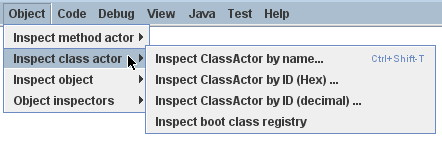

As with all standard menus, the standard Object menu also appears on
some individual Inspector windows.
When it does appear, it often contains some additional entries that are
context-dependent, which is to say their behavior depends on the
particular Inspector in which it appears.
For example, each Method Inspector adds entries that create
`Object Inspectors <#heap-objects>`__ for VM objects that represent
important information about the method being viewed: class, method,
compilation, etc.

The Standard Code Menu
^^^^^^^^^^^^^^^^^^^^^^

The standard Code menu offers a number of ways to locate and view code
in the VM:

-  *at current selection*: the currently selected code location
   (see `User Focus <#user-focus>`__), if set.
-  *at current IP*: at the code location of the instruction pointer in
   the currently selected thread.
-  *target code...*: a method selected interactively from all known
   compiled methods, first by class and then by method.
   Typing into a filter field in these dialogs makes them a very fast
   way to find an existing compilation.
-  *method code by name*: a method described interactively by
   specifying a name.
-  *boot image method codew*:
-  *target code address*: compiled code located at a memory address
   entered interactively into a dialog.

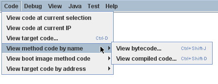

The Standard Debug Menu
^^^^^^^^^^^^^^^^^^^^^^^

The standard Debug menu is unusual in that contains two categories of
entries (both related to debugging), separated by a horizontal line.

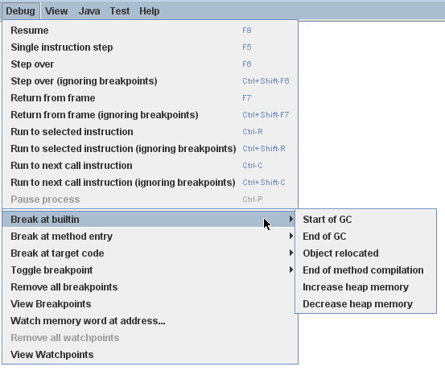

The first category of menu entries provide debugging control of the VM process: *Resume*, *Step* (sometimes known as "step in"), *Step over*, *Return* (sometimes known as "step out"), *Run to selected...*, *Run to next call...*, *Pause*, and variations.

The second category offers management of `breakpoints <#breakpoints>`__ and `watchpoints <#watchpoints>`__ in the VM's process.

-  *Break at builtin*: produces a submenu containing predefined locations in the VM at which breakpoints can be set; this is a convenience for setting breakpoints at significant VM events, without requiring that the user know in advance exactly what method represents the action.
-  *Break at method entry*: produces one of a variety of dialogs for specifying methods at which an entry breakpoint should be set.
-  *Break at target code*: produces one of a variety of dialogs for specifying locations in memory at which a machine code breakpoint should be set.
-  *Toggle breakpoint*: turns on or off the breakpoint at the currently selected code location (see `User Focus <#user-focus>`__).
-  *Remove all breakpoints*: (enabled only when there are breakpoints set) clears all breakpoints from the VM process.
-  *View Breakpoints*: creates the `Breakpoints Inspector <#breakpoints>`__.
-  *Watch memory word at address*: produces a dialog in which the use can enter a specific memory address in hexadecimal, which will be used as the origin of a newly created `Object Inspector <#heap-objects>`__.
-  *Remove all watchpoints*: (enabled only when there are watchpoints set) clears all watchpoints from the VM process.
-  *View Watchpoints*: creates the `Watchpoints Inspector <#watchpoints>`__.

The Standard View Menu
^^^^^^^^^^^^^^^^^^^^^^

The standard View menu provides access to all the different kinds of Inspectors that are available during a Maxine inspection session.
Most are singletons, in which case the specified Inspector is either created or simply brought to the front if it already exists.
In the two cases where there can be any number of inspectors (Memory and Objects), submenus are dynamically generated that allow a specific inspector to be brought to the front.

-  *Boot image info*: produces the `Boot Image Inspector <#boot-image-configuration>`__
-  *Breakpoints*: produces the `Breakpoints Inspector <#breakpoints>`__
-  *Memory inspectors*: produces a dynamically generated submenu listing all existing `Memory Inspectors <#the-memory-inspector>`__.
   Selecting an entry brings the Inspector window to the foreground.
-  *Memory regions*: produces the `Memory Regions Inspector <#memory-regions>`__
-  *Method code*: produces the `Method Inspector <#machine-code>`__.
-  *Notepad*: produces the `Notepad Inspector <#notepad>`__
-  *Object Inspectors*: produces a dynamically generated submenu listing all existing `Object Inspectors <#heap-objects>`__.
   Selecting an entry brings the Inspector window to the foreground.
-  *Registers*: produces the `Registers Inspector <#registers>`__
-  *Stack*: produces the `Stacks Inspector <#stacks>`__
-  *Threads*: produces the `Threads Inspector <#threads>`__
-  *VM thread locals*: produces the `VM Thread Locals Inspector <#thread-locals>`__
-  *Watchpoints*: produces the `Watchpoints Inspector <#watchpoints>`__

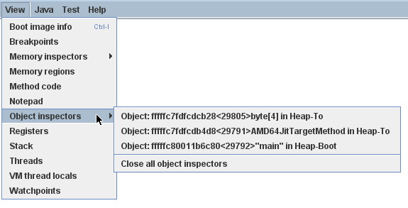

As with all standard menus, the standard View menu also appears on individual Inspector windows.
When it does appear, it contains some additional entries that are context-dependent, which is to say their behavior depends on the particular Inspector in which it appears.
The two that are present in most cases are:

-  *View options*: produces a dialog that permits setting persistent `User Preferences <#user-preferences>`__ related to the views.
   In cases where multiple Inspectors of a given kind can exist, the dialog permits setting each preference either temporarily (just for the instance being viewed) or persistently for all subsequently created Inspectors.
   These include inspectors for Memory, Methods, and Objects.
-  *Refresh*: causes data being displayed in this specific view to be reread from the VM and re-displayed.

The Default ("Triangle") Inspector Menu
^^^^^^^^^^^^^^^^^^^^^^^^^^^^^^^^^^^^^^^

Every Inspector Window contains a "Default" menu with generic command that relate mostly to windows, for example *Close*, *Close Other Inspectors*, *Refresh*, and sometimes *Print*.

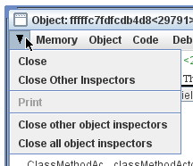

Some default menus contain additional entries with more specific, context-dependent behavior.
For example, the default menu in the Object Inspector example to the right contains the two commands *Close other object inspectors* and *Close all object inspectors*, and the default menu in every Memory Inspector contains analogous entries.

The Edit Menu
^^^^^^^^^^^^^

Every Inspector views in which the contents can be changed will display an appropriate Edit menu in the menu bar.
For example the Edit menu in a Memory Inspector contains a command to change the origin, and the Edit menu in both the Breakpoints Inspector and Watchpoints Inspector have commands to delete breakpoints and watchpoints respectively.

User Preferences
~~~~~~~~~~~~~~~~

Most of the Inspector's views provide user selectable view options that configure the information appearing in the displays.
In some cases these preferences can be set for either a specific instance (for example a particular `Object Inspector <#heap-objects>`__, or as a general preference for all subsequently created views of that kind.

The view options relevant to each Inspector are by convention available via a menu item named View Options on the window frame of the particular Inspector.
A summary of all view options, as well as other user preferences, can be managed invoking the Preferences action on the Inspector's main menu bar.
The image below displays the current appearances of the dialog for
managing user preferences.

The settings of these preferences are made persistent by default, stored in a file typically named ``maxine.ins``.

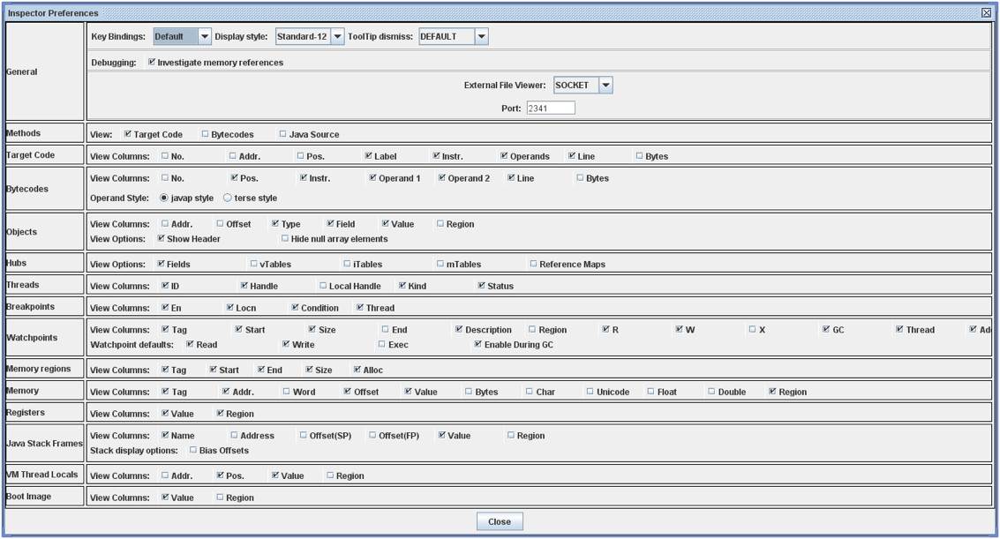

How the Inspector interacts with the Maxine VM
----------------------------------------------

This page describes how the :doc:`Maxine Inspector <./Inspector>`'s
interaction with a running VM is *implemented*.

General goals for the Inspector all deal with making development and
experimentation in the Maxine VM as productive and widely accessible as
possible:

-  Support basic debugging of the Maxine VM, something not possible
   with standard tools.
-  Make visible as much internal VM state as possible, both in terms of
   design abstractions and in terms of low-level representations, even
   when the VM is broken.
-  Provide new developers with a fast path to understanding VM
   internals.

A few general strategies guide the Inspector's implementation:

-  Run in a separate process (usually local, but see Guest VM), so that
   inspection depends neither on a correctly running VM process nor
   there being any process that all.
-  Require as little active support from the VM as possible, in
   particular require no active agent.
-  Reuse as much VM code as possible, especially
   reading/writing/understanding the low-level representations of data
   on the target platform (possibly different than the platform on
   which the Inspector runs).
-  Load VM classes into the Inspector for reflective use in
   understanding VM data.
-  Rely on platform-specific implementations for low-level interaction
   with a running VM: process control, threads, breakpoints, access to
   memory and registers.

Low-level VM Interaction
^^^^^^^^^^^^^^^^^^^^^^^^

This section describes the Inspector's access to the lowest level
abstractions in the VM process, namely the resources provided by the
underlying platform: memory, threads, and execution state.

Process control
"""""""""""""""

One of the most difficult and frustrating parts of the Inspector's
implementation is the need to implement low-level process controls on
the several supported platforms.
These controls include reading and writing from the VM's memory, finding
and inspecting threads, setting breakpoints, setting watchpoints, and
deciphering process state.

Generic controls are implemented in class
``com.sun.max.tele.debug.TeleProcess``.
Concrete subclasses using native methods implement the controls for
specific platforms:

-  *Solaris*: platform support is best on Solaris, where libproc
   provides a programmatic interface to the Solaris ``/proc``
   pseudo-filesystem.
   Watchpoints are supported with no limit on their number (see
   ``Native/tele/darwin/*.[ch]``).
-  *Linux*: the Inspector uses a mixture of ``ptrace(2)`` and ``/proc``
   (see ``Native/tele/linux/*.[ch]``).
-  *Mac OS X*: on the Mac the Inspector uses a mixture of ``ptrace(2)``
   and the Mach API (see ``Native/tele/darwin/*.[ch]``).
-  *Guest VM*: the Guest VM variant of the VM runs in a Xen domain
   where such OS services are unavailable, so controls must be
   implemented using Xen inter-domain communication.

This code can be very subtle.
It now seems to work fairly reliably, but at the cost of many hours
deciphering non-documentation and gdb source code.
In our experience, programming a debugger is a very niche activity.

Reading and writing VM memory
"""""""""""""""""""""""""""""

Low-level memory access is implemented using basic process control
methods in class ``TeleProcess``:

::

    read(Address address, BtyeBuffer buffer, int offset, int length)
    write(Address address, ByteBuffer buffer, int offset, int length)

However, interpreting the bits presents more of a challenge, since this
must be done for a VM running on a potentially different
platform.
Fortunately, the Inspector is able to load the Java classes that
describe the target platform and then reuse the VM's own code for
reading and writing bits representing the VM's internal primitive data
types.
Methods for reading and writing those types appears in interface
``com.sun.max.tele.data.DataAccess``, and all but the lowest-level read
methods are implemented by class
``com.sun.max.tele.data.DataAccessAdapter``.

For performance reasons, especially for non-local debugging such as with
the Guest VM, the Inspector caches pages of memory read since the most
recent process execution (see class
``com.sun.max.tele.page.PageDataAccess``).

Logging
"""""""

The Inspector's low-level interaction with the VM process can be
observed.
See :doc:`Low-level logging <./Debugging>` for instructions
on enabling all low-level VM logging.
In order to observe only Inspector-related events, change ``log_TELE`` to 1
in ``Native/share/log.h``, rather than ``log-ALL``.

Passive VM support
""""""""""""""""""

Although the Inspector is designed to rely as little as possible on the
internals of the VM, there are a number of ways in which the VM is
constructed to make inspection as easy as possible.
The mechanisms described in this section incur zero runtime overhead in
the VM, and involve no writing into VM memory.

Locating critical VM resources
""""""""""""""""""""""""""""""

The Inspector leverages considerable knowledge of the VM's internal data
representations to build its model of VM state, but it must have
somewhere to start when beginning to read from a memory image.
The boot image generator stores in
the boot image header a number of
addresses and other data that help the Inspector (and VM) find things.
These addresses get relocated, along with the contents of the heap,
during :doc:`Bootstrap <./Glossary>`.
The Inspector leverages detailed knowledge of the header's contents in
order to locate, among others:

-  the VM's :doc:`schemes <./Schemes>` bindings, which are loaded into the
   Inspector
-  the :doc:`boot heap <./Boot-Image>`
-  the boot code region
-  the class registry
-  the list of dynamically allocated heap segments
-  the list of `thread local
   areas <./Threads#thread-locals-area-(tla)>`__
-  the entry location of key methods

Field access
""""""""""""

The Inspector uses a variety of mechanisms to locate instance or class
fields in the heap.
During the Inspector's starting sequence (when little is yet known about
VM state), fields are typically located by relying on specific knowledge
of a few key object types, possibly using Java reflection on the VM
classes (which are all loaded into the Inspector).
This kind of access is relatively unsafe, since it bypasses the type
system in the running VM.
There are more abstract ways to access fields, but they rely on the
Inspector's model of VM's class registry, which must first be created
using the low-level mechanisms.

The simplest way to exploit higher-level field access mechanisms is to
annotate (in VM code) fields of interest using ``@INSPECTED``.
The main method in ``com.sun.max.tele.field.TeleFields`` reads VM sources,
generates field access methods, and writes them back into itself for use
by the Inspector.
These access method implementations hide all the indirections necessary
to read or write field data (taking into account the hardware platform,
the layout being used, the particular representation for the object, and
the class layout) and return values of the desired types.

Method access
"""""""""""""

The Inspector uses a variety of mechanisms to locate methods and their
compilations (either instance or class).
Specific methods can be called out for enhanced access by the Inspector
by annotating (in VM code) those methods using ``@INSPECTED``.
The offline program TeleMethods reads VM sources, generates method
access methods, and writes them into class
``com.sun.max.tele.method.TeleMethods``.
These access method implementations hide all the indirection necessary
to locate the annotated methods and their meta-information.

Method interpretation
"""""""""""""""""""""

VM methods annotated with ``@INSPECTED`` can be interpreted by the
Inspector (for example, see ``TeleMethodAccess.interpret()``).
Interpretation takes place in the Inspector's process, but in the
execution context of the VM: object references are boxed locations in VM
memory, reading/writing is redirected through VM data access, class ID
lookup is redirected to the Inspector's model of the VM's class
registry, and bytecodes are located using reflection on the VM's code
loaded in the Inspector.

The Inspector's interpreter runs very slowly.
It is used routinely by the Inspector in only a few situations, where VM
data structures to be navigated are too complex (e.g. a hash table) to
be navigated robustly using low-level techniques.
For example, see the Inspector method
``TeleCodeCache.findCompiledCode(Address)``, which interprets remotely the
VM method ``Code.codePointerToTargetMethod(Address)``.

Although the interpreter is in principle capable of writing into VM
memory, it is not used in any situations where this happens.

Active VM support
^^^^^^^^^^^^^^^^^

Active VM support for inspection is kept to an absolute minimum, but in
most cases either incur very little VM overhead or are enabled only when
the VM is being inspected.
There are several flavors of support mechanisms:

-  Distinguished fields, usually static, where the VM records
   information exclusively for the consumption by the inspector.
-  Distinguished methods, usually static and usually empty, called by
   VM code exclusively as potential breakpoint locations for the
   inspector; this is a weak kind of event mechanism.
-  Special VM memory locations into which the Inspector writes for
   consumption by specific VM mechanisms.

As a matter of organization, this kind of support is implemented mainly
by VM classes in the package ``com.sun.max.vm.tele``, but it often imposes
some obligations on specific :doc:`scheme <./Schemes>` implementations, for
example to store a value or call a method.
These obligations are increasingly specified and documented in scheme
definitions.

The remainder of this section describes a few areas of active VM support
for inspection.

Enabling inspection support
"""""""""""""""""""""""""""

Many support mechanisms in the VM operate conditionally, depending on
the value of static method
``com.sun.max.vm.tele.Inspectable.isVmInspected()``.
This predicate checks one of the bits in the static field
``Inspectable.flags`` in VM memory, which can be set in one of two ways:

-  When the VM is started by the Inspector, the Inspector sets that bit
   in VM memory early in its startup sequence (see Inspector method
   ``TeleVM.modifyInspectableFlags()``).
-  When the VM is not started by the Inspector, but when it is
   anticipated that the Inspector might subsequently attach the VM
   process, a command line option to the VM makes it inspectable.

At present, the VM cannot be made inspectable unless this bit is set
early during the VM startup sequence.

Class-related support
"""""""""""""""""""""

The Inspector tracks every class loaded in the VM, as represented by the
current contents of the VM's ``ClassRegistry``; the Inspector maintains
that information using the Inspector class ``TeleClassRegistry``.

The Inspector initializes its ``TeleClassRegistry`` at VM startup,
effectively identifying the classes already loaded in the boot heap; it
does this by directly reading (using low-level operations that rely on
significant knowledge of the data structures involved) the contents of
the VM's ``ClassRegistry`` in the boot heap. As noted earlier, this data
structure cannot be read using the more abstract, relatively more
type-safe techniques in the inspector because those techniques rely on
type information stored in the ``TeleClassRegistry``.
This is one of many circularities in the Inspector that reflect the
underlying meta-circularity of the Maxine VM.

As the VM loads additional classes dynamically, and when inspection is
enabled, the VM records them using the following static fields in VM
memory:

.. code:: java

    package com.sun.max.vm.tele;

    public final class InspectableClassInfo {
        ...
        @INSPECTED
        private static ClassActor[] classActors;

        @INSPECTED
        private static int classActorCount = 0;
        ...
    }

The Inspector refreshes the ``TeleClassRegistry`` each time the VM process
halts: it checks the VM's count against its cache and reads information
from VM memory about any newly loaded classes.

No provision is made for tracking classes that the VM *unloads*.
In fact, the VM implements class unloading by garbage collection, and a
regrettable consequence of this inspection mechanism is that it prevents
class unloading.
This is by far the most egregious interference visited upon the VM by
the Inspector, and it might be corrected in the future.

Heap-related support
""""""""""""""""""""

Implementations of the Maxine VM's
:doc:`heap scheme <./Schemes>`
are obliged to make certain calls, as documented and supported by the
scheme's static inner class ``com.sun.max.vm.heap.HeapScheme.Inspect``.
All of these calls delegate to the VM class
``com.sun.max.vm.tele.InspectableHeapInfo``, which provides several kinds
of services when the VM is being inspected (described below): heap
allocations, object relocations, and events.

Allocated heap segments
~~~~~~~~~~~~~~~~~~~~~~~

An inspectable, static field in the VM class
``com.sun.max.vm.tele.InspectableHeapInfo`` holds the list of memory
regions currently allocated as heap segments.
This list is read from VM memory by the Inspector each time the VM
process halts; any additional heap segment allocations to the
information are tracked in the inspector class ``TeleHeap``.
This enables the inspector to make a quick first check about whether a
VM memory location could hold a valid heap object, and permits a
visualization of all memory allocations made by the VM.

Object locations
~~~~~~~~~~~~~~~~

The Inspector tracks heap objects of interest: sometimes because the
user is viewing them, but much more frequently because they represent
vital information about the execution state of the VM.
In the presence of relocating garbage collection that can take place at
any time (with respect to the Inspector), there is no practical way for
the Inspector to track object locations without some support from the
VM.

When the VM is being inspected, it actively supports object tracking by
allocating in VM memory an additional root table: an array of addresses
that are treated by garbage collection implementations as roots to be
updated as needed when objects move.
Entries in this table are treated by the VM as weak references: both to
minimize disruption of VM operation and for the Inspector to discover
when objects have become garbage.
Access to the root table is provided via inspectable static fields in
the VM class ``com.sun.max.vm.tele.InspectableHeapInfo``.

The Inspector checks the root table each time the VM halts.
It does so by reading two static fields in
``com.sun.max.vm.tele.InspectableHeapInfo`` that are incremented by the
garbage collectors: one counts the number of collections initiated so
far and one counts the number of collections completed.
The Inspector compares those two counters with their previous values.
If a new collection has concluded since the last refresh, then the
entire contents of the VM's root table are copied into the Inspector's
cache, where they are available for the Inspector's implementation of
remote object references.
When the Inspector creates a new object Reference, based on a specific
address in the VM's heap, that value is added to an empty slot in the
Inspector's root table cache and is written through to the corresponding
location in the VM's root table.

The Inspector can also observe object relocation directly, if needed, by
setting a breakpoint on the following method:

::

    InspectableHeapInfo.inspectableObjectRelocated(Address oldCellLocation, Address newCellLocation){}

This empty method is called each time an object is relocated and it
exists for just this purpose.

Heap events
~~~~~~~~~~~

The VM makes it convenient for the Inspector to halt the VM process at
certain interesting events.
It does so by creating special methods that are called at those times,
methods that do nothing in the VM, but which are convenient for the
Inspector to set breakpoints.
The VM class ``com.sun.max.vm.tele.InspectableHeapInfo`` contains the
following methods of this sort:

-  ``inspectableGCStarted()``
-  ``inspectableGCCompleted()``
-  ``inspectableObjectRelocated()``
-  ``inspectableIncreaseMemoryRequested()``
-  ``inspectableDecreaseMemoryRequested()``

Code-related support
""""""""""""""""""""

The Inspector's breakpoint mechanism requires active support from the
Maxine VM's
:doc:`compilation scheme <./Schemes>`.
As a machine-level debugger, the natural kind of breakpoint supported by
the Inspector (and by the underlying platform) is specified in terms of
a memory location in compiled machine code.
However, the Inspector also supports breakpoints specified in terms of a
method's signature, so-called
:doc:`bytecode breakpoints <./Glossary>`.
The Maxine VM runs only compiled code, so a bytecode breakpoint is
understood to mean that there should be a corresponding machine code
breakpoint set in every compilation of the method, present or future.
A bytecode breakpoint can even be set (at location 0) for methods not
yet loaded into the VM.

An early implementation of bytecode breakpoints divided responsibility
for setting these breakpoints: the Inspector set them for existing
compilations and a request was written into a queue in the VM for the
runtime compiler, which would create the machine code breakpoints in any
subsequent compilation.
This approach had an irreconcilable race and was replaced by the simpler
approach of halting the VM immediately after every method compilation.
The Inspector would compare the compiled method against its current list
and set a machine code breakpoint if needed.
This implementation proved to incur too much overhead for non-local
debugging, notably for Guest VM.

The current implementation (see Inspector class
``TeleBytecodeBreakpoint``) halts the VM after method compilations, but
filters those events.
Each time the Inspector's list of bytecode breakpoints changes, the
Inspector writes into VM memory an easily parsed list of textual type
descriptors for those classes for which one or more bytecode breakpoints
are currently set.
Implementations of the VM's
:doc:`compilation scheme <./Schemes>`
are required to call a static notification method in the scheme's static
inner class ``com.sun.max.vm.heap.HeapScheme.Inspect`` at the beginning
and end of each method compilation.
This delegates to VM class ``com.sun.max.vm.tele.InspectableCodeInfo``,
where the current list of classes is consulted.
If the class of the method just compiled is in the list, it results in a
call to the empty method ``inspectableCompilationEvent()`` where the
Inspector can set a breakpoint.
Filtering only by class, not by method, results in some false positives,
but the mechanism is simple, fully synchronous, and reduces the
interruptions more than enough.

Inspector evolution
^^^^^^^^^^^^^^^^^^^

The Inspector's life began long before the Maxine VM could run usefully,
a period during which the novel meta-circular, highly modular
architecture was refined and techniques for generating the Maxine
:doc:`boot image <./Boot-Image>` developed. The Inspector's original role was
static visualization and exploration of the binary boot image in terms
of the higher level abstractions of the VM, something that could not be
done by any existing tool.

As the VM became increasingly able to run through its startup
(:doc:`bootstrap sequence <./Glossary>`), basic debugging features
were added: process controls and breakpoints, along with register and
stack visualization.
The Inspector remained monolithic (with no model/view separation) and
single-threaded (the GUI froze during VM process execution).

As the VM began to execute application code, work on the Inspector
proceeded incrementally along several fronts simultaneously:

-  *features on demand*: as the VM became more functional and the
   concerns of the development team evolved, many more features were
   added: additional views of internal state, more debugging controls,
   more user options, etc.
   These were, and continue to be, demand-driven according to the needs
   of the project.
-  *UI functionality and consistency*: the early window implementations
   were rewritten for code reuse and standardized around new
   conventions, the menu system was standardized and extended, Java
   Look & Feel compliance was added, and more.
-  *re-architecting internals*: model/view separation was added, direct
   interaction among views was replaced by a user event model, change
   propagation was refined, generalized notion of user selection
   defined, etc.

Once model/view separation became explicit in the previously monolithic
code base, the Inspector sources were incrementally split into two
"projects" with distinct concerns:

-  **Tele**: responsible for communicating with and managing the VM
   process, essentially being the keeper of the model of the VM's state
   at any point during the session.
-  **Inspector**: responsible for user interaction, state
   visualization, and command handling.

Dependence between the two projects eventually became one-way, but
remained complex: the ``Inspector`` project depends directly on many
implementation classes from both the ``Tele`` and VM projects.
A subsequent effort to further separate the two by re-engineering around
new, well-documented interfaces is only partially complete.

As the Inspector evolved into a heavily used debugger, demand grew for
multi-threaded management of the VM process so that the GUI would remain
live and in particular so that a user could interrupt ("Pause") a
running VM. Concurrent operation is now supported, but the retrofit
(over complex, distributed interactions in the reading and modeling of
VM state) is incomplete Occasional concurrency problems appear as the VM
and Inspector evolve.
