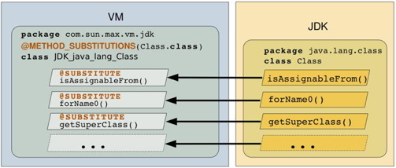

JDK interoperation
==================

The Maxine VM is designed to work with a standard, unmodified JDK, which requires special machinery for dealing dynamically with important JDK classes.
This machinery is implemented by compiler extensions, configured by :doc:`annotations <./Glossary>`.

JDK classes in the JDK can be modified during VM bootstrapping, both by adding fields and by replacing methods.

Aliases
-------

Aliases give the VM access to otherwise inaccessible fields and methods.
Java's access rules for class members can be bypassed using reflection, but at the cost of boxing/unboxing and the absence of static type checking.
The Maxine VM avoids these costs with the annotation ``@ALIAS``.
This causes an annotated field or method to act as an alias for a field or method in another class, giving straightforward, statically type-checked access.

For example, the ``name`` field in class ``com.sun.max.vm.jdk.JDK_java_lang_Thread`` provides read/write access to the private field ``name`` in class ``java.lang.Thread``.

.. code:: java

    @ALIAS(declaringClass = java.lang.Thread.class)
    char[] name;

In case the ``declaringClass`` is private ``declaringClassName`` can be
used instead.

.. code:: java

    @ALIAS(declaringClassName = "java.lang.reflect.Proxy$ProxyClassFactory")
    public final static String proxyClassNamePrefix = "$Proxy";

Additionally in case the type of the object itself is private, the
``descriptor`` parameter can be used.

.. code:: java

    @ALIAS(declaringClass = Proxy.class, descriptor="Ljava/lang/reflect/WeakCache;")
    private static Object proxyClassCache = null;

Inner classes are also supported through the ``innerClass`` parameter.

.. code:: java

    @ALIAS(declaringClass = ClassLoader.class, innerClass = "NativeLibrary")
    private long handle;

For more discussion and an example of method aliasing, see the Javadoc
comments for the annotation ``com.sun.max.annotate.@ALIAS``.

Aliasing is often used together with method substitution, so that a
method substituted into a different class will have access to otherwise
inaccessible members of that different class.
See below an example of how this is done.

Method substitution
-------------------

During startup the Maxine VM replaces specified methods in specified JDK classes.
How this is configured is best described by the following example, in
which the method ``java.lang.Class.isAssignableFrom()`` gets replaced
(along with others).
The following figure depicts the result of the substitution.

#. Create a Maxine VM class for holding all methods to be substituted
   into ``java.lang.Class``.
   By convention, this class is named ``JDK_java_lang_Class`` (in
   package ``com.sun.max.vm.jdk``).
#. | Annotate this class with ``@METHOD_SUBSTITUTIONS``, which
     identifies
   | the target of the substitutions as follows:

   .. code:: java

        @METHOD_SUBSTITUTIONS(java.lang.Class.class)

#. Create a method in class ``JDK_java_lang_Class`` with signature
   identical to the method to be substituted, in this case
   ``isAssignableFrom()``.
   The body of this method does what is actually needed during
   execution of the Maxine VM.
   This often entails delegating part of all of the operation to a VM
   object that is the Maxine runtime implementation of the JDK object,
   in this case an instance class
   ``com.sun.max.vm.actor.holder.ClassActor``.
#. | Annotate the newly created method with ``@SUBSTITUTE``: which marks
   | the method for substitution.

Substituted methods don't necessarily have access to fields and methods
of the class into which they are substituted, but language access rules
can be defeated by creating aliases for those fields and methods as
needed.
For example, the method ``setName()`` in class
``com.sun.max.vm.jdk.JDK_java_lang_Thread`` assigns the name of a thread,
both in the VM's representation (a ``VmThread``) and in the JDK's instance
of class ``java.lang.Thread`` via assignment to a field alias.

.. code:: java

    @ALIAS(declaringClass = Thread.class)
    char[] name;

    ...

    /**
     * Sets the name of the the thread, also updating the name in the corresponding VmThread.
     * @param name new name for thread
     */
    @SUBSTITUTE
    private void setName(String name) {
        thisThread().checkAccess();
        if (thisVMThread() != null) {
            thisVMThread().setName(name);  // Set name in the VM's thread object
        }
        this.name = name.toCharArray();    // Set name in the JDK's thread object
    }

Note that when substituting a constructor, the new constructor no longer
invokes the original initializers (if any) of the corresponding class,
so one needs to do this explicitly.

.. code:: java

    @SUBSTITUTE(constructor = true, signatureDescriptor = "(Ljava/lang/invoke/LambdaForm;ILjava/lang/String;Ljava/lang/String;Ljava/lang/invoke/MethodType;)V")
    private void InvokerBytecodeGenerator(Object lambdaForm, int localsMapSize,
                                          String className, String invokerName, MethodType invokerType) {
        if (invokerName.contains(".")) {
            int p = invokerName.indexOf(".");
            className = invokerName.substring(0, p);
            invokerName = invokerName.substring(p + 1);
        }
        className = maxMakeDumpableClassName(className);
        this.className = superName + "$" + className;
        this.sourceFile = "LambdaForm$" + className;
        this.lambdaForm = lambdaForm;
        this.invokerName = invokerName;
        this.invokerType = invokerType;
        this.localsMap = new int[localsMapSize];

        // When substituting a constructor the initializers of the original class are no longer invoked, thus we need
        // to initialize cpPatches explicitly here
        cpPatches = new HashMap<>();
    }

Field injection
---------------

During startup the VM synthesizes and injects additional fields into
core JDK classes.
Injected fields typically link instances of JDK objects to their
internal VM representation.
For example, the VM injects into class ``java.lang.Class`` a reference to
each class's internal VM representation: an instance of class
``com.sun.max.vm.actor.holder.ClassActor``.
The following figure depicts the result of the injection.

.. image:: images/InjectedFields.jpg

A field injection is defined by creating an instance of class ``com.sun.max.vm.actor.member.InjectedFieldActor``.

For example, the following code (which creates a static variable in class ``com.sun.max.vm.actor.member.InjectedFieldActor``), causes the VM to inject the ``ClassActor`` reference field into class ``java.lang.Class``, as shown in the above figure.

.. code:: java

    /**
     * A field of type {@link ClassActor} injected into {@link Class}.
     */
    public static final InjectedReferenceFieldActor<ClassActor> Class_classActor = new InjectedReferenceFieldActor<ClassActor>(Class.class, ClassActor.class) {
        @HOSTED_ONLY
        @Override
        public ReferenceValue readInjectedValue(Object object) {
            final Class javaClass = (Class) object;
            return ReferenceValue.from(ClassActor.fromJava(javaClass));
        }
    };
