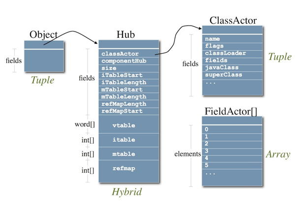
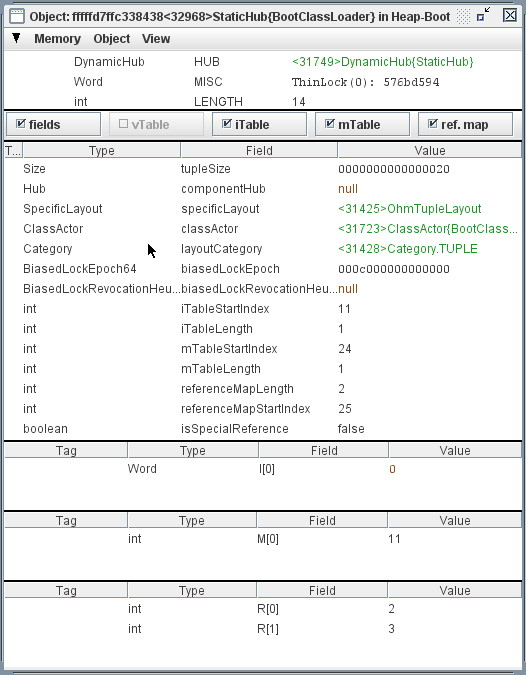

Object representation in the Maxine VM
======================================

This page describes how objects are represented in the Maxine VM
runtime.
This aspect of the VM is especially interesting for a variety of
reasons.

As a :doc:`metacircular VM <./Glossary>`, most of Maxine's
internal data structures, including those used to implement the
representation of objects
(e.g. :doc:`Actors <./Actors>`, :doc:`layouts <./Schemes>`), are themselves
represented uniformly as objects.
Some of those objects, however, (see `hubs <#hubs>`__) are of an extended
type that is not expressible in the Java language, and one kind of
object (`static tuples <#static-tuples>`__) cannot be expressed by any
type.

As a compiled-only VM, Maxine can only start
(:doc:`"bootstrap" <./Glossary>`) from a synthesized binary boot
image (see
`Garden of Eden configurations <http://en.wikipedia.org/wiki/Garden_of_Eden_(cellular_automaton)>`__).
The :doc:`boot heap <./Boot-Image>` in particular is a
translation of an object graph created during
:doc:`boot image generation <./Boot-Image>`, a process
complicated by the fact that generation is hosted on a standard VM but
must deal with objects that cannot be represented in the standard
language.

Heap
----

The general behavior of the heap (memory management, object allocation,
garbage collection, etc.) is configurable, defined by a binding to the
VM's heap scheme.

The runtime heap contains multiple heap segments.
The first heap segment is the
boot heap, which is part of the VM's
:doc:`boot image <./Boot-Image>` and which is pre-populated with the objects
that the VM needs in order to begin operation.
The boot heap is represented in the standard heap format and is
exceptional only in that its objects never move, although they may
become permanent garbage.

Object layout
-------------

The lowest level details of memory layout of objects (in particular with
respect to headers, contents, and pointers) is configured by a binding
to the VM's :doc:`layout scheme <./Schemes>`.
The scheme describes layout information for the three kinds
of `object representation <#object-representation>`__ described below:
tuples, arrays, and hybrids.
All memory access to the various parts of an object takes place via a
layout scheme.

Of the two runtime layout schemes currently implemented, described
below, `OHM layout`_ is the default binding for CISC architectures
(like x86) and `HOM layout`_ is the default for RISC architectures
such as SPARC.
A third layout scheme (`Hosted layout`_) is specialized for
representing objects being prototyped during
:doc:`boot image generation <./Boot-Image>`, especially
important for the kinds of VM objects that cannot be directly
represented as standard Java objects.

OHM layout
~~~~~~~~~~

The OHM object layout scheme, described as Origin-Header-Mixed, is
implemented by class ``com.sun.max.vm.layout.ohm.OhmLayoutScheme``.

The OHM layout packs tuple objects for minimal space consumption,
observing alignment restrictions.
Tuple objects have a 2 word header and are laid out as shown below:

::

    cell/origin --> +-------------+
                    |    class    |  // reference to dynamic hub of class
                    +-------------+
                    |    misc     |  // monitor and hashcode
           data --> +=============+
                    |             |
                    :   fields    :  // mixed reference and scalar data
                    |             |
                    +-------------+

OHM array objects have a 3 word header and are laid out as shown below
(OHM hybrid objects have a similar header):

::

    cell/origin --> +-------------+
                    |    class    |  // reference to dynamic hub of class
                    +-------------+
                    |    misc     |  // monitor and hashcode
                    +-------------+
                    |   length    |
           data --> +=============+
                    |             |
                    :  elements   :
                    |             |
                    +-------------+

HOM layout
~~~~~~~~~~

The HOM object layout scheme, described as Header-Origin-Mixed, is
implemented by class ``com.sun.max.vm.layout.hom.HomLayoutScheme``.

This layout enables more optimized code on SPARC for accessing array
elements smaller than a word.
The origin points at array element 0, so there is no need to perform
address arithmetic to skip over the header.
On the other hand, this layout requires reading memory for converting
between cell and origin addresses, since they are not the same (as they
are for `OHM layout <#ohm-layout>`__).

The HOM layout packs tuple objects for minimal space consumption,
observing alignment restrictions.
Tuple objects have a 2 word header and are laid out as shown below.

::

           cell --> +-------------+
                    |    misc     |  // monitor and hashcode
                    +-------------+
                    |   class     |  // reference to dynamic hub of class
    origin/data --> +=============+
                    |             |
                    :   fields    :  // mixed reference and scalar data
                    |             |
                    +-------------+

Array objects have a 3 word header and are laid out as shown below (HOM
hybrid objects have a similar header):

::

           cell --> +-------------+
                    |   length    |
                    +-------------+
                    |    misc     |  // monitor and hashcode
                    +-------------+
                    |   class     |  // reference to dynamic hub of class
    origin/data --> +=============+
                    |             |
                    :  elements   :
                    |             |
                    +-------------+

Hosted layout
~~~~~~~~~~~~~

The Hosted object layout scheme is not designed for VM runtime, but
rather for the object prototyping phase of
boot image generation.
The generation machinery runs hosted on a standard Java VM and creates a
prototype boot heap that will
eventually be translated into the binary format of the target platform,
and written into the boot image.
This layout scheme is implemented by class
``com.sun.max.vm.layout.hosted.HostedLayoutScheme``.

Object representation
---------------------

There are exactly three low-level memory representations in the Maxine
heap: `Tuple representation`_ (for Java object instances),
`Array representation`_ (for Java array instances), and
`Hybrid representation`_ (for Maxine hubs).
Memory access to the parts of these three representations is mediated
through a :doc:`layout scheme <./Schemes>`.
Types and other aspects of object contents are defined by the
``ClassActor`` instance that represents type of the object being
represented.

Tuple representation
~~~~~~~~~~~~~~~~~~~~

A Maxine tuple is a memory representation that combines a two-word
header plus a collection of named values (fields).
The names, types, and locations of the values are defined by an instance
of class ``TupleClassActor``.

As with all Maxine object representations, the first word of the tuple
header points at the `Dynamic hubs`_ for the class.
The second (misc) word is used for a variety of purposes, including hash
code and locking information.

The tuple memory representation is used to represent standard Java class
instances in the heap.
Note that `Static tuples`_ are also represented this way,
even they are not ordinary class instances and have no type.

Array representation
~~~~~~~~~~~~~~~~~~~~

A Maxine array is a memory representation that combines a three-word
header plus some fixed number of values of identical type.
The type of the array elements is defined by an instance of class
``ArrayClassActor``.

As with all Maxine object representations, the first word of the array
header points at the `Dynamic hubs`_ for the class.
The second (misc) word is used for a variety of purposes, including hash
code and locking information.
The third word holds the number of elements contained in the array.

The array memory representation is used to represent standard Java
arrays in the heap.

Hybrid representation
~~~~~~~~~~~~~~~~~~~~~

A Maxine hybrid is a memory representation that combines a three-word
header, a collection of named values (fields), and an array of
words.
The names, types, and location of the field values, together with
information about the arrays, are defined by an instance of class
``HybridClassActor``.
Although hybrids are represented uniformly as instances of a class, they
are classes that cannot be expressed in standard Java.

As with all Maxine object representations, the first word of the hybrid
header points at the `Dynamic hubs`_ for the class.
The second (misc) word is used for a variety of purposes, including hash
code and locking information.
The third word holds the number of words contained in the array.

The hybrid memory representation is used to represent
Maxine `Hubs`_ in the heap, even though hubs are not standard Java
class instances and cannot be described with standard Java types.

Actors
------

Specific information about the contents of heap instances (tuples,
arrays, and hybrids) is represented uniformly using Java type
information, represented in the form of
:doc:`class actors <./Actors>`.
Class actors are themselves instances (represented as tuples) in the
heap of the three types ``TupleClassActor``, ``ArrayClassActor``, and
``HybridClassActor`` respectively.

Hubs
----

A hub is a `Hybrid representation`_ instance holding
information, derived from a :doc:`class actor <./Actors>`, that
must be immediately accessible (one memory hop) from each class
instance.
That is, a hub is what is pointed to from the (logical) class word of an
object's header.
A hub corresponds to a
`TIB <http://docs.codehaus.org/display/RVM/Object+Model>`__ in the Jikes
RVM.

Hubs hold the vtables and itables used for efficient method
dispatch.
They also hold all the information needed when a garbage collector
visits each instance, for example the size and reference map for the
instance, avoiding the need to reference any further objects, which
could themselves be subject to collection.

Hubs contain both named fields and embedded arrays and thus cannot be
represented as a ordinary Java objects.
They are instead represented as `Hybrid representation`_, and
their contents are described uniformly with a class actor (describing a
class not expressible in standard Java) of type ``HybridClassActor``.

There are two kinds of hubs, distinguished by the context of their
use: `Dynamic hubs`_ are pointed to by class instances,
and `Static hubs`_ are pointed to by
`Static tuples`_.

Dynamic hubs
~~~~~~~~~~~~

Every ``ClassActor`` in the VM holds a reference to the dynamic hub (an
instance of class ``com.sun.max.vm.actor.holder.DynamicHub``) for the
class it represents.
Every instance of that class in the heap contains (in its header) a
reference to that dynamic hub.

The following figure depicts the relationships among a class instance,
the dynamic hub for the class, and the ``ClassActor`` for the type.
The figure also demonstrates the three kinds of representation in the
heap: tuples, arrays, and hybrids.

The following screen snapshot shows how the dynamic hub for class
``com.sun.max.vm.type.BootClassLoader`` appears in an *Object Inspector View* in the :doc:`Maxine Inspector <./Inspector>`.
It is displayed as a hybrid object, with special display machinery for
viewing the embedded arrays.
The inspector's frame header identifies it as
``DynamicHubBootClassLoader``, meaning *the ``DynamicHub`` associated with class ``BootClassLoader``*.

Note also that the hub pointer for this instance of ``DynamicHub`` points
to another ``DynamicHub`` which is described as *the ``DynamicHub`` associated with class ``DynamicHub``*. In other words, the hub pointer of
that hub points at itself: it participates in its own implementation and
closes the hub recursion loop.

.. image:: images/Inspector-DynamicHub.jpg

Static hubs
~~~~~~~~~~~

There is exactly one kind of instance, represented as
a `Tuple representation`_ in the heap, that cannot be treated
uniformly by the VM's type information: a static tuple.
A static tuple is unique in that cannot be described by a type, so it
has no ClassActor that describes its type and must be treated
exceptionally wherever types matter.

Every ``ClassActor`` in the VM holds a reference to a static tuple, which
holds values of the class (static) variables for the class.
Each ``ClassActor`` also holds a reference to the static hub, an instance
of class ``com.sun.max.vm.actor.holder.StaticHub``, to which the header of
the static tuple points.
This specialized hub, to which only the static tuple points, allows
uniform treatment by GC.

The following screen snapshot shows how the static hub for class
``com.sun.max.vm.type.BootClassLoader`` appears in an *Object Inspector View* in the :doc:`Maxine Inspector <./Inspector>`.
It is displayed as a `Hybrid representation`_, with
special display machinery for viewing the embedded arrays.
The inspector's frame header identifies it as
``StaticHubBootClassLoader``, meaning *the ``StaticHub`` associated with class ``BootClassLoader``*.

Static tuples
-------------

A static tuple is special kind of heap object that holds the class
variables (static fields) for a class in the VM.
Although it appears superficially as an ordinary
`Tuple representation`_, with named fields, it is unique within
the heap in that it has no type at all: think of it as a singularity in
the VM's type system (a byproduct of the VM's
:doc:`metacircularity <./Glossary>`).
In practice, this means that there is no ``ClassActor`` describing any
static tuple; they must be treated using implicit knowledge of their
structure.

On the other hand, static tuples are represented the same as other
tuples in heap memory, and are amenable to ordinary garbage collection
without special handling.
This is done by having a special kind of `Static hubs`_ to
which they point.

The following screen snapshot shows how the static tuple for class
``com.sun.max.vm.type.BootClassLoader`` appears in an *Object Inspector View* in the :doc:`Maxine Inspector <./Inspector>`.
It is displayed as an ordinary tuple, but the frame header identifies it
as ``StaticTupleBootClassLoader`` and its hub pointer refers to an
instance of ``StaticHub``.

.. image:: images/Inspector-StaticTuple.jpg
