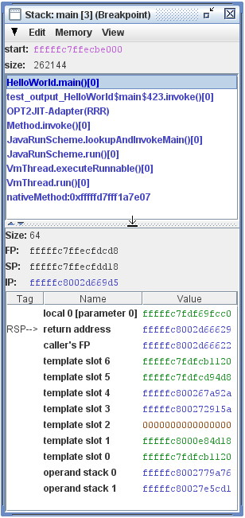

Stack Walking in the Maxine VM
==============================

This page documents the stack walking mechanism in the Maxine VM.
It details the uses of stack walking as well as special considerations
that need to be taken into account by the stack walking mechanism.

A stack walk is a traversal through the frames of the stack going from
callee frames to caller frames.
That is, the walk through the frames is performed in the reverse order
in which the frames were pushed on the stack.
This reflects the fact that callee frames always know the execution
context of their caller's frame but the inverse is not true.
The execution context of interest for a given frame is the value of the
instruction position, stack pointer and frame pointer in the frame.
Note that the exact meaning of a caller's instruction pointer depends on
the underlying platform.
For example, on x86 platforms, the ``CALL`` instruction pushes the address
of the instruction following the ``CALL`` instruction to the stack.
On SPARC systems, the ``CALL`` instruction saves the address of the ``CALL``
instruction in the link register, ``%i7``.
This distinction is critical when searching the stack for exception
handlers (more on this below).

A stack walk is always performed for a specific reason or purpose which
are detailed below.

Stack walk purpose 1: Exception handling
----------------------------------------

When an exception is thrown in Java, the stack of the current thread is
searched for an appropriate exception handler.
For each target method corresponding to a frame on the stack, a search
is performed for an exception handler based on the current instruction
position in the target method and the type of the exception.
Searching a target method based on these parameters takes into account
how the exception handler information is encoded.

Once an exception handler is found, the stack frame walker adjusts the
current execution context to affect a transfer of control to the
exception handler.
This usually just involves updating the current stack, frame and
instruction pointers.
However, there are two special cases where a little more has to be done
when restoring the state before executing the exception handler:

-  **Implicit Exceptions:**
   An implicit exception is one caused by a trap.
   In Maxine, the implicit exceptions resulting from traps are null
   pointer exceptions, divide-by-zero exceptions and stack overflow
   errors.
   When an implicit exception occurs in a frame that has an exception
   handler for it, then the register state at the exception point must
   be restored before jumping to the exception handler.
   This allows a register allocator to operate on the assumption there
   is a direct control flow edge from any instruction that may cause an
   implicit exception to a local exception handler covering that
   instruction.
-  **Stack Overflow:** Stack overflow detection is implemented by using
   protecting a guard page near the end of the stack.
   When a stack overflow error occurs, the guard page was unprotected
   by the low-level trap handler.
   Before jumping to the exception handler, the guard page must be
   reprotected.

Stack walk purpose 2: Stack reference map preparation
-----------------------------------------------------

The garbage collector needs information about which stack slots and
registers contain object references; this information is stored in the
stack reference map in thread-local memory.
When preparing a reference map, three cases can be distinguished:

-  Top-most method.
   This method provides information about its stack and its registers.
-  Caller saved method.
   This method provides information about its stack.
   When the method is at a position where it called a callee saved
   method, it must provide a reference map for its registers too.
-  Callee-saved method.
   All references of this method lie on the stack.
   However, if they are references or not depends on the registers of
   the caller method.
   Therefore this method must provide a reference map that contains a
   bit for each register that is saved on the stack.

Note that this model imposes the following constraints:

#. A callee-saved method cannot call another callee-saved method.
#. A callee-saved method cannot be on the top of the stack.

One other important constraint on stack walking for reference map
preparation is that it must never perform any heap-allocation.

Stack walk purpose 3: Stack inspection
--------------------------------------

There are a number of subsystems in the VM that needs to inspect the
frames on a stack.
These are lumped together under the purpose of stack inspection and
perform one of the two following inspections supported by the stack
frame walker:

#. **Low Level Inspection:** The stack frame walker allocates no memory
   when performing this kind of inspection. The client is notified (via
   the visitor pattern) of the following information for each stack
   frame traversed:

   -  Stack pointer
   -  Frame pointer
   -  Instruction pointer
   -  Target method (optional)
      This stack walk is used with different visitors for exception
      handling, reference map preparation, the
      :doc:`inspector <./Inspector>`, and deoptimization.

#. **High Level Inspection:** The stack frame walker returns a list of
   method objects denoting the methods for each frame on the stack.

The subsystems using a stack inspection are detailed below.

Creating a stack trace for an exception
~~~~~~~~~~~~~~~~~~~~~~~~~~~~~~~~~~~~~~~

When walking the stack for creating a stack trace, the stack frame
walker must distinguish between frames that should be included in the
stack trace (application visible methods) and those that should not.
An object of type java.lang.StackTraceElement is created for each method
included in the stack trace.

Inspector
~~~~~~~~~

:doc:`The Maxine Inspector <./Inspector>` wants to get a detailed view of all
stack frames for display in the Stack Inspector view.
For Java methods at stop positions or JIT methods, the JVM bytecode
level local variables, operand stack and monitor state is of
interest.
These are the same data structures that deoptimization,
on-stack-replacement, or a Java interpreter would work with.

JDK
~~~

The following JDK methods require inspecting the stack.
They all only operate on methods that have an associated class method
actor.

-  ``java.security.AccessController.getProtectionDomains()``
-  ``sun.reflect.Reflection.getCallerMethod(int)``
-  ``JVM_LatestUserDefinedLoader`` (defined in ``jvm.h``)

Deoptimization
~~~~~~~~~~~~~~

In order to deoptimize a certain method that is not the top most method,
the stack frame walker needs to patch the return address of a method to
a different location (that performs the deoptimization and continues
execution in the interpreter).
Note that also when this method is selected to perform a catch for an
exception, deoptimization must be performed.
